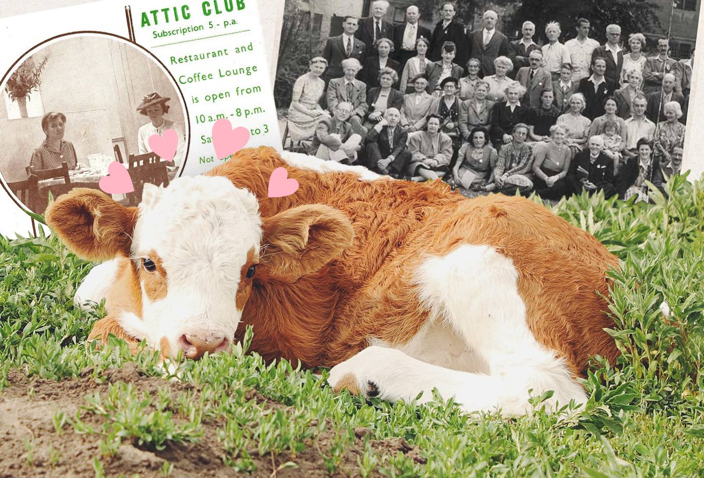
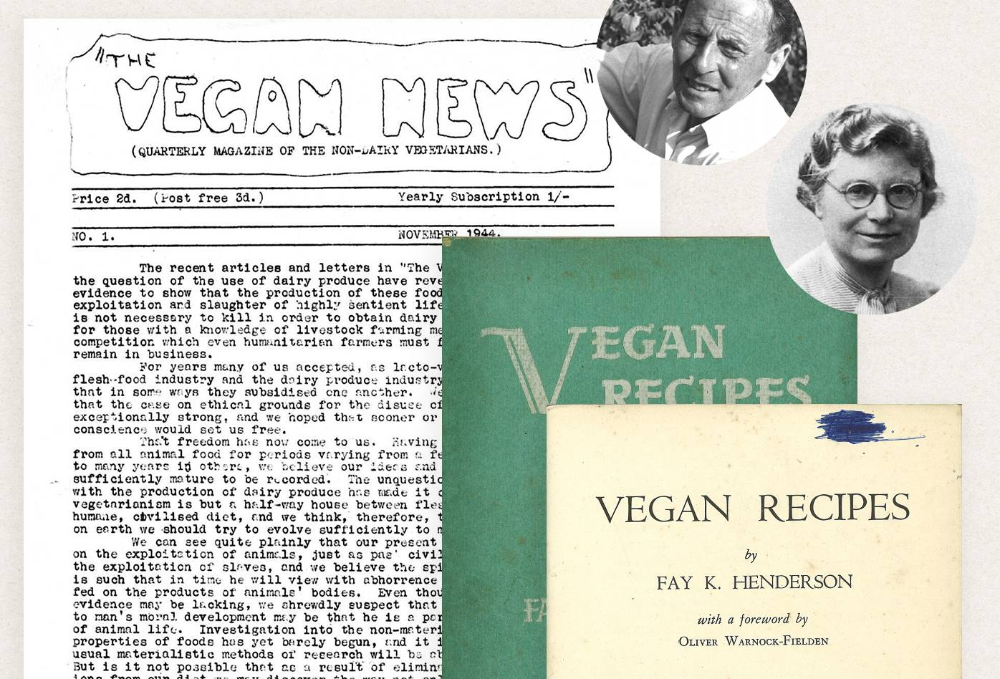

Antes de leer este artículo, recomiendo leer [¿Por qué liberación animal?](/por-qué-liberación-animal/){:class="link"}

Por ahora voy a definir veganismo como la ideología opuesta al carnismo, y un conjunto de hábitos de vida que tienen como fin que la persona quien los practica, evite participar directamente de la explotación y violencia sistemática en contra de los animales no humanos, más adelante iremos a la definición más o menos oficial. Como el enfoque de este proyecto es la liberación animal, no el veganismo, debo empezar señalando las diferencias entre los dos conceptos, antes de entrar al detalle de qué es veganismo y cuál es su origen. 

Imaginemos una sociedad como la nuestra, en la que la mayoría no practica el veganismo ni sabe qué es, pero llega al poder un gobierno o una revolución con suficiente apoyo popular, y un programa de reformas dentro de las que se encuentra una transición a un sistema de alimentación y producción a base de plantas, que concluiría en una sociedad donde los animales ya no son explotados, en donde la que la mayoría sería vegana porque es lo normal. En dicha sociedad, la ideología vegana no se opondría a la corriente de pensamiento principal sino que haría parte de esta, y seguir un estilo de vida vegano no sería inconveniente porque todo el sistema de alimentación y producción sería a base de plantas. Alcanzar ese escenario dependería de acciones políticas colectivas realizadas por un movimiento a favor de la liberación animal y otras causas que sí le interesarían a la mayoría de la población. Este movimiento terminaría tomándose el poder popular, mediático y político. Seguramente quienes lideran ese movimiento tendrían que practicar el veganismo, porque de otra manera sería difícil que tuviesen alguna credibilidad, pero no sería tan relevante que la mayoría de personas que trabajan en dicho movimiento lo hagan o no. Al final, la explotación a los animales terminaría, y la mayoría adoptaría el veganismo porque debido a un cambio estructural, sería lo normal.

Ahora imaginemos una sociedad como la nuestra, en la que la mayoría no practica el veganismo ni sabe qué es, pero una minoría vegana, se dedica a promover el veganismo desde su activismo, logra convencer a más y más personas para que adopten esta ideología y práctica por iniciativa propia, hasta que llega un momento en el que la mayoría de la población es vegana, las industrias de explotación animal dejan de ser rentables, y como no producen dinero, las juntas directivas deciden que ya no van a criar más animales para su explotación.

Cuando nos enfocamos en liberación animal, se pueden imaginar caminos para alcanzar ese objetivo, que estarían más alineados con movimientos sociales, poder político y cambios estructurales desde acciones colectivas. Mientras que cuando nos enfocamos en el veganismo, nos quedan únicamente las acciones individuales que sólo tendrían éxito si se adoptasen masivamente, lo que es poco probable porque la mayoría de las personas no estáría dispuesta a pensar por fuera de la corriente principal, y mucho menos a cambiar la conveniencia de consumir lo que está disponible rápida y fácilmente, que además les conecta socialmente, por la inconveniencia de cocinar y buscar productos a base de plantas, restaurantes veganos y demás, enfrentando dificultades para compartir con sus familias y comunidades.

También hay que tener en cuenta que en la mayoría de los casos, la práctica del veganismo no se mantiene durante toda la vida, debido a una fundamentación teórica deficiente o nula que tiene como consecuencia dietas absurdas o complicaciones exageradas que terminan en el abandono de la iniciativa, además está la frustración ante lo inconveniente que puede llegar a ser el veganismo comparado con la falta de resultados visibles, en cuanto a una reducción de la violencia sistemática contra los animales. Generalmente nisiquiera es posible convencer a la familia y personas cercanas de que adopten el veganismo, y para ver cambios habría que convencer por lo menos a todo un barrio.

No se cuáles podrían ser las razones por las que tantas personas y organizaciones se dedican a la promoción del veganismo como base moral y única estrategia para alcanzar la liberación animal, pero creo que tiene que ver con que tanto el origen del concepto moderno de veganismo, como el de la mayoría de estas organizaciónes, está en Norteamérica y Europa, en países con culturas en donde el individualismo y la ideología capitalista están arraigados más profundamente que en la nuestra, para alguien que cree en el capitalismo, la explotación y violencia sistemática contra animales no humanos únicamente se puede entender como un problema de oferta y demanda.

Si pensamos en una transición hacia un sistema de alimentación y producción a base de plantas, y liberación animal, el objetivo parecería más plausible desde las acciones colectivas, y como parte de la agenda de un movimiento social fuerte con capacidad adquirir suficiente poder popular, mediático y político como para generar cambios estructurales, sin embargo solidarizarse con los animales desde los hábitos de vida es valioso en cuanto a que podemos demostrar con nuestras vidas que las cosas pueden ser diferentes, manifestamos con nuestras acciones que así las industrias de explotación animal cuenten con la mayoría, con nosotros no cuentan, y al respaldar nuestra ideología con nuestros hábitos de vida, en la mayoría de los casos nos interesamos más en cuestionar y profundizar en el conocimiento de las diferentes ideas que la componen y temas relacionados, mientras que una ideología que se asume sin comprometer las acciones cotidianas, puede terminar como un interés al que no se le otorga mucha relevancia.

Debo reiterar que no estoy tratando de manipular emocionalmente a nadie para que practique el veganismo, considero que es una desición que cada cual debe tomar sin presiones y a partir del conociminto, que no debería ser requisito para que alguien que quiera apoyar la causa de la liberación animal pueda hacerlo, y que lastimosamente no tiene consecuencias medibles. Tampoco quiero vender el veganismo como quien vende un carro viejo o un disco rayado, minimizando sus limitaciones y exagerando sus beneficios, sí recomiendo que a quien le llame la atención le de una oportunidad. Es una de las pocas ocasiones en las que se pueden alinear los valores con los hábitos de vida, lo que resulta empoderador y forja el carácter. Además una dieta a base de plantas bien llevada, que en mi caso ha sido únicamente comer variado y bastante más suplementarme de vitamina B12, ha sido beneficioso para mi salud, lo que ha mejorado considerablemente mi calidad de vida.

Además de las limitaciones del veganismo también hay que tener en cuenta algunos riesgos que vienen de discursos que nada tienen que ver con la filosofía o ideología, pero que se le han ido incorporando de algun manera. La misantropía no tiene ninguna justificación en el veganismo, pero muchas personas veganas terminan alienadas odiando a la humanidad, hay una concepción ingenua de la coherencia que es muy común debido a que no se tiene en cuenta que estamos enfrentando problemas estructurales más que individuales por lo que se ven muchos casos de personas veganas exigiendo una coherencia que jamás podrían alcanzar, y hay ciertas ideas de pensamiento mágico que no tienen mucho sentido, pero que son comunes entre personas veganas. Creo que estos riesgos pueden mitigarse relativamente fácil evitando los discursos de las celebridades del veganismo y haciendo un esfuerzo para pensar críticamente.

### ¿Qué es veganismo?

Esta es la definición más o menos oficial, de la Sociedad Vegana, responsable de acuñar el término. 

> “Una filosofía y forma de vida que busca excluir —hasta donde sea posible y practicable— todas las formas de explotación de, o crueldad contra los animales para comida, ropa o cualquier otro propósito; y por extensión, promueve el desarrollo y uso de alternativas libres de animales para el beneficio de los animales, los humanos y el ambiente. En términos dietarios, denota la práctica de prescindir de todos los productos derivados total o parcialmente de animales.”
> {: class="p-big"}

[Definición de veganismo・The Vegan society](https://www.vegansociety.com/go-vegan/definition-veganism){:target='_blank' class="caption"} anotaciones sobre la definición de veganismo y ebook sobre la historia de la Sociedad Vegana. (En Inglés).

Esta definición no deja explícito que la oposición a la explotación y la crueldad incluye las que se ejercen en contra de humanas y humanos quienes también pertenecemos al reino animal, y así no lo fuésemos, también somos alguien y sentimos. Esta falta de una postura explícita en contra de la explotación como principio, le ha permitido a muchas personas veganas y organizaciones dedicadas a la promoción del veganismo, asumir posiciones que van desde la hostilidad en contra de las y los humanos víctimas de explotación y violencia, por considerarles asesinas y asesinos de animales, alineando sus discursos con posturas favorables al fascismo, hasta una solidaridad que se limita únicamente a las personas diversas, incluyendo la promoción del veganismo dentro de los activismos _"woke,"_ despojados de conciencia de clase, que encajan con los intereses de la facción "liberal" del establecimiento capitalista. Ambas posturas son desfavorables para que florezca un movimiento de liberación animal con suficiente apoyo popular como para impulsar cambios estructurales.

Un veganismo despojado de solidaridad con otros movimientos sociales, despolitizado y desligado de cualquier intención revolucionaria termina convirtiendose en una tendencia de consumo domesticada por el capitalismo. No hay ningún problema con que una persona seaa vegana y no tenga interés en otros movimientos sociales, o que lo haga por salud, la motivación no deebería ser relevante si lo que importa es la acción, el problema es cuando la práctica del veganismo se instrumentaliza como herramienta de relaciones públicas de régimenes de ocupación y opresión como el ejército de ocupación Israelita en Palestina, instituciones imperialistas como el departamento de estado de los Estados Unidos, para impulsar la narrativa de que la destrucción ambiental es un problema de consumo individual, y cuando los medios veganos se ponen al servicio de la promoción de la imagen de personas e instituciones con prácticas éticamente cuestionables como billonarios y grandes corporaciones. A esta instrumentalización se le llama _vegan washing_ (lavado de cara vegano), y si quienes practican el veganismo no tienen un contexto geopolítico ni una postura crítica frente al sistema, probablemente van a terminar reproduciendo las narrativas y sirviendo a los intereses del gran capital.

La parte de hasta donde sea posible y practicable, tiene en cuenta que debido a que vivimos en sociedades en las que la explotación y violencia sistemática contra los animales son estructurales, es posible que una persona vea limitada su capacidad para practicar el veganismo debido a su falta de conocimiento o sus condiciones materiales. Aunque seguir un estilo de vida vegan no es necesariamente más costoso, no es lo mismo intentarlo cuando se cuenta con ciertas condiciones materiales básicas y tiempo para cocinar y/o buscar productos específicos a cuando se vive en la precariedad y la explotación. Tanto entre personas no veganas como veganas está arraigada la creencia de que el si el veganismo debe ejecutarse de manera impecable, y quienes no logran superar dificultades que a la larga no son tan relevantes, terminan desanimandose y no solo abandonando el veganismo sino también desvinculandose totalmente de la lucha por la liberación animal.

### Origen de la palabra veganismo

La palabra _veganismo_ fue acuñada en 1944 durante la fundación de _The Vegan Society_. Por ahora empezaremos la historia desde ese punto, pero es importante anotar que han existido personas veganas antes de que se acuñase la palabra, y probablemente existe una historia de veganismos o ideologías similares que se desarrollaron en otras culturas. Es una historia que desconozco y no sabría ni por dónde empezar a investigarla, pero me parece importante mencionar.

Durante la década de 1830, la palabra _vegetariano_ se usaba para referirse a una persona que no consume ningún producto de origen animal para ningún propósito y que sigue una dieta predominantemente crudivegana. Sin embargo, durante el establecimiento de The _Vegetarian Society_ en 1847, su organización incluyó las secreciones de animales como parte de la dieta vegetariana, para acomodar a algunos de sus miembros consumidores de huevos y lácteos. Esto generó discusiones que se evidencian en las páginas de _The Vegetarian Journal,_ entre 1909 y 1912. Y que revivieron después de la Primera Guerra Mundial, concluyendo en la fundación de _The Vegan Society_ en 1944.

Entre los que se oponían al uso de productos de origen animal estaba Mr Donald Watson, quien experimentaba con una dieta crudivegana (no recomendable a menos que se cuente con asesoría profesional), e intentó sin éxito formar un grupo de vegetarianos sin lácteos _"Non-dairy vegetarians"_, dentro de la Sociedad Vegetariana. La Sociedad decidió que era mejor enfocar sus energías en abolir el consumo de carne y le sugirió a Watson fundar una organización aparte. En noviembre de 1944, Elsie Shringley, Donald Watson y otras cuatro personas se reunieron en el _Attic Club_ del distrito de Holborn, en Londres, para discutir la fundación de una nueva organización.

[ HAN Mengqi・Unsplash](https://unsplash.com/@hanmengqi?utm_source=unsplash&utm_medium=referral&utm_content=creditCopyText){:target='_blank' class="caption"}

El nombre _"Non-dairy vegetarians"_ es muy largo, incómodo y no deja claro la oposición a considerar los huevos y otras secreciones como comida. Donald Watson y Dorothy Morgan se basaron en las ideas de Mr G.A. Henderson y Fay K. Henderson: _"Allvega, Allvegan"_, para proponer el nombre _"Vegan"_. Entre las propuestas de otros miembros estaban: _"Dairyban", "Vitan", "Benevore", "Sanivore" y "Beaumangeur"_.

La palabra _vegan_ está formada por las primeras y últimas letras de la palabra _vegetarian_ porque el veganismo surge del vegetarianismo y es su conclusión lógica. Donald Watson fue la primera persona en usar la palabra en una publicación, _The Vegan News_ - de 1944, y Fay K. Henderson la primera en publicar un libro de cocina con la palabra en el título, _Vegan Recipes_ - de 1946.

[The Vegan News #1・Donald Watson, ](https://web.archive.org/web/20130226003431/http://www.ukveggie.com/vegan_news/vegan_news_1.pdf){:target='_blank' class="caption"} [Vegan Recipes・Fay K. Henderson](https://www.happycow.net/blog/vegan-recipes/){:target='_blank' class="caption"}

"Vega" era una palabra reconocida entre las personas vegetarianas de los años 30, ya que _"The Vega"_ fue el nombre de uno de los restaurantes vegetarianos con mejor reputación en Londres durante esa década. _The Vega_ fue fundado por Jenny y Walter Fleiss, quienes tenían un restaurante con el mismo nombre en Colonia y que cerraron para migrar a Londres, al enterarse de que Walter era el número 17 en la lista negra de la Gestapo.

La Sociedad Vegana fue fundada en un periodo de guerra en el que el gobierno distribuía la comida de forma racionada. Watson contactó al gobierno para solicitar una ración de grasa adecuada para personas veganas y para que se les permitiera comprar productos que estuvieran en suministro limitado como lentejas y fruta seca. El gobierno nunca aprobó su solicitud.

En 1949, Leslie J. Cross advirtió que la palabra veganismo no tenía una definición y sugirió esta: _"El principio de la emancipación de los animales de la explotación que sufren por parte de los humanos_". La definición se fue afinando con los años hasta la que tenemos actualmente.

Al acercarme a las publicaciones de la Sociedad Vegana, encontré unos documentales para la promoción del veganismo, anteriores al auge de los documentales veganos que vivimos actualmente, y tan de su época cada uno que parecen _Mockumentales,_ Aunque me encanta verlos, y valoro el trabajo de la Sociedad Vegana, entender la explotación a los animales como un problema de oferta y demanda que se soluciona desde el consumo responsable (votando con el dólar), no está funcionando ni va a funcionar.

<iframe src="https://www.youtube.com/embed/VlTYjaQLy2o" frameborder="0" allow="accelerometer; autoplay; clipboard-write; encrypted-media; gyroscope; picture-in-picture" allowfullscreen></iframe>

[OpenDoor・The Vegan Society・1976・Youtube](https://www.youtube.com/watch?v=VlTYjaQLy2o&list=PL4qbpZDdKQPkIvWmOM3BSfeFURNQJaHWO&index=14){:target='_blank' class="caption"}

<iframe width="560" height="315" src="https://www.youtube.com/embed/ce5lY9lXmK0" frameborder="0" allow="accelerometer; autoplay; clipboard-write; encrypted-media; gyroscope; picture-in-picture" allowfullscreen></iframe>

[Truth or Dairy・The Vegan Society・1994・Youtube](https://www.youtube.com/watch?v=ce5lY9lXmK0&list=PL4qbpZDdKQPkIvWmOM3BSfeFURNQJaHWO&index=15){:target='_blank' class="caption"}

La siguiente lección será una introducción a la nutrición basada en plantas, y a partir de la tercera lección conoceremos las prácticas de las diferentes industrias de explotación animal deacuerdo a los manuales de zootecnia disponibles para ser consultados por cualquiera. Según [Paula Moreno](https://instagram.com/corazonanimalvegano){:target='_blank' class="link"}, veterinaria de la Universidad Nacional de Colombia, describen un escenario "ideal", que no se ajusta a una realidad todavía peor, Aunque las industrias hacen un esfuerzo considerable por ocultar sus prácticas, al mismo tiempo deben capacitar a quienes las ejecutan lo que les obliga a hacerlas evidentes, así sea en versiones suavizadas y llenas de eufemismos.

*Los medios veganos con mayor visibilidad como Livekindly, Plant Based News, Totally Vegan Buzz, y Veg News, se dedican a promocionar el veganismo despojado de conciencia de clase, haciendo propaganda a grandes corporaciones de comida rápida, y lavando la imagen de billonarios imperialistas,  explotadores de la clase trabajadora. Es vergonzoso, y justifica la idea de que el veganismo es una moda para personas privilegiadas e ingenuas, con problemas de superioridad moral.*

### Referencias

* [Definition of Veganism・The Vegan Society](https://www.vegansociety.com/go-vegan/definition-veganism){:target='_blank' class="reference"}
* [The Vegan News 01・Donald Watson](https://web.archive.org/web/20130226003431/http://www.ukveggie.com/vegan_news/vegan_news_1.pdf){:target='_blank' class="reference"}
* [Ripened by Human Determination. 70 years of The Vegan Society・The Vegan Society](https://www.vegansociety.com/sites/default/files/uploads/Ripened%20by%20human%20determination.pdf){:target='_blank' class="reference"}
* [70 Years Ago: Vegan Cookbook No. 1: 70 Vegans In The UK・Happy Cow Blog](https://www.happycow.net/blog/vegan-recipes/){:target='_blank' class="reference"}
* [Woke Imperialism・Chris Hedges](https://chrishedges.substack.com/p/listen-to-this-article-woke-imperialism#details){:target='_blank' class="reference"}
* [Humans of CIA・Youtube](https://www.youtube.com/watch?v=X55JPbAMc9g){:target='_blank' class="reference"}
* [Vegan Washing: How Israel Uses Veganism to Gloss Over Palestinian Oppression・Mint Press News](https://www.mintpressnews.com/vegan-washing-israel-veganism-palestinian-oppression/262707){:target='_blank' class="reference"}
* [US Department Of Defense Closer To Putting Plant-Based Meals On The Military Menu・Plant Based News](https://plantbasednews.org/lifestyle/food/department-defense-plant-based-meals-military/){:target='_blank' class="reference"}
* [The Faux Generosity of the Super-Wealthy: Why Bill Gates is a Menace to Society・Mint Press News](https://www.mintpressnews.com/faux-generosity-how-bill-gates-bought-his-power-and-influence/263208/){:target='_blank' class="reference"}
* [5 Ways Bill Gates Is Making the World a Little More Vegan・Livekindly](https://www.livekindly.co/how-bill-gates-making-world-vegan/){:target='_blank' class="reference"}
* [Jeff Bezos, Bill Gates, and Richard Branson Lead $90 Million Investment to Create Next Vegan Impossible Burger・Veg News](https://vegnews.com/2019/2/jeff-bezos-bill-gates-and-richard-branson-lead-90-million-investment-to-create-next-vegan-impossible-burger){:target='_blank' class="reference"}
