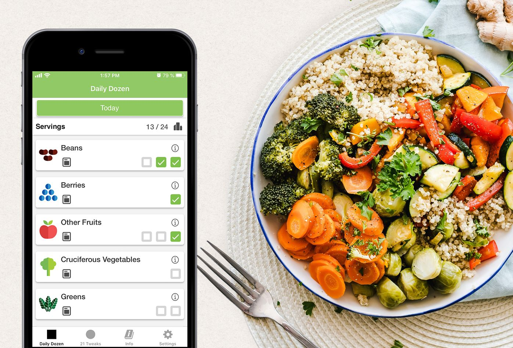

La dieta americana estándar (_Standard American Diet. SAD_ ⎯ _sad_ = triste), es una manera pésima de alimentarse y prácticamente garantiza sufrir deficiencias y enfermedades. Nuestra dieta estándar es cada vez más parecida a la dieta americana, con un consumo desmesurado de productos de origen animal casi siempre procesados industrialmente. Sólo tenemos que observar a nuestros familiares mayores de treinta o cuarenta años para notar la variedad de achaques y enfermedades que se han normalizado en nuestra cultura.

Seguir una dieta a base de plantas adecuada no solamente no es peligroso ni difícil sino que es la opción más saludable según los resultados del trabajo de cada vez más profesionales de la salud. Puedes ver una lista algunes de les más destacadxs en el artículo: [Profesionales de la salud que recomiendan seguir una dieta a base de plantas.](/profesionales-de-la-salud-que-recomiendan-dietas-a-base-de-plantas/){:target="_blank" class="link"} La posición de la Academia de Nutrición y Dietética _"Academy of Nutrition and Dietetics"_ sobre las dietas a base de plantas, es que si se planean apropiadamente traen beneficios para la prevención y tratamiento de algunas enfermedades, y que son adecuadas para cualquier etapa de la vida. Menciona además que deben acompañarse de suplementos de vitamina B12.

[Posición de la Academia de Nutrición y Dietétetica: Dietas Vegetarianas. ](https://pubmed.ncbi.nlm.nih.gov/27886704/){:class="link no-underline" target="_blank"}

La historia de nuestro amigue ex-vegetariane no es evidencia de que alimentarse a base de plantas no funcione sino de que se alimentó mal y seguramente todavía lo hace, aunque ahora incluya cadáveres en su dieta. Independientemente de que la dieta incluya o no partes de, o cosas que salen de animales, si nos alimentamos mal seguramente sufriremos deficiencias y enfermedades. Es muy probable que quienes siguen una dieta estándar tengan una deficiencia de fibra dietaria sin saberlo.

### Les veganes somos una clase de vegetarianxs :/ y los programas de 21, 22 y 30 días.

Quienes seguimos una dieta a base de plantas estamos catalogades como vegetarianes estrictos en el lenguaje profesional, porque el veganismo va más allá de una dieta. Debido a esto frecuentemente se usa la palabra vegetariane para referirse tanto a vegetarianes como a veganes (vegetarianes estrictos). Es bastante confuso porque a menudo nos encontramos con esa palabra y no sabemos si están hablando de vegetarianes y veganes, o de vegetarianes o veganes. También hay problemas de traducción, en _“The Game Changers”_, los subtítulos y doblaje dicen vegetariane cuando el documetal claramente habla de nutrición a base de plantas exclusivamente, el programa _“Vegan Kickstart”_ del Comité de Médicos Por Una Medicina Responsable solía traducirse como “Vegetariano en 21 días”.

Hay varios programas de 21, 22 o 30 días para que una persona no vegana aprenda lo que necesita para hacer su transición durante ese período. Estos números están basados en el tiempo necesario para que se vean resultados y la creencia en que durante ese tiempo se puede crear un hábito, la creencia se basa en una teoría sobre la plasticidad del cerebro que ya está rebatida y tampoco estamos muy seguros de que los programas funcionen para todes porque no siempre es posible dedicar una o dos horas diarias durante 21 o 30 días para hacer un ejercicio. Teniendo en cuenta esas limitaciones decidimos cubrir los temas que consideramos necesarios, sin proponer un rango de tiempo para estudiarlos. Tampoco es necesario inscribirse para acceder al contenido, seguir a perfiles o postear en redes sociales. Más que inscribirse y completar un programa es tener claro porque queremos ser veganes, donde encontrar la información pertinente para hacerlo correctamente y contar con un acompañamiento si es necesario.

Una buena aproximación sería no tener miedo al cambio, comer bastante y variado sin obsesionarse, no restringir calorías, suspender temporalmente los objetivos de transformación física, no buscar la perfección ni desanimarse ante los errores, apoyarse en la aplicación de la [Docena Diaria](https://nutritionfacts.org/es/video/la-docena-diaria-del-dr-greger-2/){:target="_blank" class="link"} y consultar con una o un [nutricionista vegane](/nutricionistas-veganxs-en-Colombia/){:target="_blank" class="link"} en caso de encontrar problemas o tener requerimientos nutricionales específicos.

[Alex Green   |   Pexels](https://www.pexels.com/@alex-green){:target='_blank' class="caption"}

## Información básica sobre nutrición basada en plantas

Buena parte del contenido para esta sección está sustentado en el curso: [Principios de una alimentación vegana saludable](https://www.udemy.com/course/principios-de-una-alimentacion-vegana-saludable){:target="_blank" class="link"} de Alejandra Zuluaga. Alejandra hace un excelente trabajo presentando de manera muy clara información que no es necesariamente fácil de conseguir y entender.

### ¿Cuál es la dieta más adecuada?

La dieta más adecuada para nuestra especie es una donde todas las calorías vengan de frutas, semillas, verduras, cereales integrales y legumbres. Alta en fibra y baja en alimentos procesados. Una alimentación basada en plantas bien llevada puede ayudar a prevenir el 80% de las enfermedades crónicas y degenerativas, también detener el progreso de enfermedades coronarias y diabetes.

### ¿Cómo obtener los nutrientes necesarios?

Necesitamos nutrientes, no alimentos específicos. No necesitamos cadáveres sino proteínas, hierro y otros nutrientes. No necesitamos leche de animales de otras especies sino calcio. Mejor que pensar en reemplazar partes de animales y secreciones con algo parecido pero de origen vegetal, es entender que nutrientes necesitamos y cómo los podemos obtener.

### Proteínas

Las [proteínas](https://nutritionstudies.org/es/de-donde-obtienes-tu-proteina/){:target="_blank" class="link"} se pueden entender muy por encima como: "nutrientes con funciones variadas formados por cadenas de aminoácidos". Hay miles de aminoácidos, pero los que tienen que ver con nuestra especie son 20. De estos 20, 11 son fabricados por nuestro cuerpo y 9 debemos ingerirlos. A esos 9 se les llama aminoácidos esenciales.

Es casi imposible sufrir una deficiencia de proteínas si la dieta no restringe calorías, por eso tanto veganes como no veganes generalmente excedemos los requerimientos diarios de aminoácidos esenciales. Se recomienda consumir 0.8 gramos por cada kilo de nuestro peso ideal según la altura, y aumentar la cantidad si estamos buscando aumentar la masa muscular. Antes que sacar cuentas es mejor comer lo suficiente, variado y listo.

#### El mito de la superioridad de la proteína de origen animal

Este mito tiene su origen en los estudios de Thomas B. Osborne y Lafayette Mendel en 1909. En el estudio alimentaron a unas ratas albinas con proteína de leche y a otras con proteína de trigo. Las ratas alimentadas con proteína de leche crecieron más rápido y eran más grandes. Concluyeron que existían diferencias entre el valor biológico de la proteína animal y vegetal, determinando que las proteínas animales son completas y de alto valor biológico mientras que las vegetales incompletas con valor biológico limitado. Esta clasificación fue desmentida en 1950 porque nuestras necesidades nutricionales y expectativa de vida es muy distinta a la de las ratas, crecemos más lento porque vivimos más tiempo y nuestras demandas metabólicas son diferentes.

Consumir proteínas de origen animal conlleva un exceso del aminoácido metionina, exceso que promueve un envejecimiento acelerado. Las especies animales con una expectativa de vida menor son las que tienen una concentración mayor de metionina en sus tejidos.

Todas las proteínas contienen algo de aminoácidos esenciales y no es necesario consumir grandes cantidades de aminoácidos en cada comida porque los músculos y el hígado pueden almacenarlos para distribuirlos cuando y donde sea necesario.

### Ácidos grasos. Omega 3 y omega 6

La enzima que metaboliza estos ácidos grasos es la Delta-6 Desaturase que puede metabolizar omega 3 u omega 6, pero no los dos al tiempo. Como el omega 3 es el ácido graso que necesitamos, es recomendable evitar fuentes de omega 6. Necesitamos unos 2.6 gramos diarios de omega 3.

#### Fuentes de omega 3:

* Nueces sin procesar
* Semillas de chía
* Semillas de linaza molida (La absorción de omega 3 a partir de este alimento es de 90%)

#### Fuentes de omega 6 (Evitar)

* Pollo
* Postres a base de harina refinada
* Aderezos de mala calidad
* Papas fritas
* Nueces mixtas con aceites vegetales horneados (De paquete de mecato)

Aunque no es requerido se recomienda tomar suplementos de Omega 3. - DHA y EPA de mínimo 250ml por día y que provenga de microalgas.

### Hierro y zinc

En una dieta a base de plantas se puede consumir más hierro y zinc que una dieta estándar, pero la asimilación depende de evitar inhibidores como el café, el vino y el té, cuyo consumo debe evitarse al menos una hora antes de una comida.

La absorción se puede mejorar con promotores que serían cítricos, nueces y granos integrales, vegetales de hoja verde, cebolla y ajo.

#### Hierro hemo y hierro no hemo

El hierro hemo es proporcionado por comida de origen animal y no está presente en plantas, el hierro hemo se absorbe más fácilmente, pero el cuerpo se va acostumbrando al hierro no hemo y va mejorando su absorción. Hay algunos estudios que relacionan el consumo de hierro hemo con enfermedades, por tanto el hierro no hemo es más seguro.

[La seguridad del hierro hemo en comparación con el no hemo ](https://nutritionfacts.org/es/video/la-seguridad-del-hemo-vs-hierro-no-hemo/){:class="link no-underline" target="_blank"}

### Yodo

Consumir yodo es necesario para la salud de la tiroides y la regulación del metabolismo. La disponibilidad del yodo en las plantas depende del suelo en el que fueron cultivadas, pero únicamente necesitarían suplementos de yodo mujeres embarazadas y personas que siguen una dieta en la que se ha eliminado completamente la sal.

### Calcio

Los lácteos tienen mucho calcio pero también un montón hormonas de crecimiento diseñadas para que ternerxs crezcan rápidamente, pero que en humanxs favorece la formación de cánceres como el de próstata y mamas.

Algunos alimentos de origen vegetal que contienen suficiente calcio son:

* Avena
* Leche de soya
* Brócoli
* Kale
* Tempeh
* Manzana
* Coles de Bruselas.

Se puede aumentar la absorción de hierro, calcio y zinc, consumiendo ajo y cebolla.

### Vitamina D

La vitamina D se obtiene a partir de la exposición al sol que puede ser veinte minutos al día sin bloqueador, pero la absorción depende de muchos factores, por lo que puede ser recomendable suplementarse con entre 600 a 1000 UI diariamente, independientemente del tipo de alimentación que se lleve.

### Vitamina B12

Esta vitamina es muy importante para proteger el sistema nervioso. No se encuentra en animales ni plantas sino en microorganismos, bacterias y hongos.

Es necesario consumir suplementos de vitamina B12. 50 microgramos diarios ó 2500 en una sola dosis semanal.

### Carbohidratos

Generalmente se asocia una dieta baja en carbohidratos con una dieta saludable, pero restringir carbohidratos no es recomendable. Los carbohidratos que se deben evitar son los simples que son los que vienen de harinas refinadas, aceites refinados, azúcares, etc. Los carbohidratos complejos que vienen de cereales integrales y otros alimentos de origen vegetal son necesarios y se deben incluir.

[ Ella Olson   |   Pexels](https://www.pexels.com/@ella-olsson-572949){:target='_blank' class="caption"}

## Planear más fácilmente con la Docena Diaria

El doctor Michael Greger tenía pegada en su nevera una lista con los alimentos que trataba de incluir a diario en su dieta, e iba chequeando una vez los consumía. Esta práctica evolucionó en el desarrollo de la aplicación La [Docena Diaria](https://nutritionfacts.org/es/video/la-docena-diaria-del-dr-greger-2/){:target='_blank' class="link"} que es básicamente la lista del doctor Greger para chequear en nuestros teléfonos y simplificar la tarea de planear nuestra alimentación.

Podemos revisar cuáles alimentos necesitamos para tener en cuenta en el momento de comprar comida y usar la aplicación durante el día para saber si estamos comiendo lo que necesitamos mientras nos acostumbramos a una dieta a base de plantas.

Un plato bien balanceado puede ser: un cuarto de leguminosas, un cuarto de cereales integrales, la mitad de vegetales de la familia crucífera, hojas verdes y otros vegetales, una fruta como postre y un vaso de agua.

Además de comer lo mejor que podamos, incluir algo de ejercicio diario, exposición al sol o un suplemento de vitamina D, recordar la suplementación de vitamina B12 y ya está. El doctor Greger recomienda no obsesionarse con chequear todos los alimentos porque hay días en los que no podemos comer así de bien. Si un día no comemos bien, al otro día podemos intentar hacerlo mejor y así.

Video sobre la Docena Diaria. Recuerda configurar los subtítulos para Español.

<iframe src="https://www.youtube.com/embed/g0UmVKA-4F8" frameborder="0" allow="accelerometer; autoplay; clipboard-write; encrypted-media; gyroscope; picture-in-picture" allowfullscreen></iframe>

[La Docena Diaria del Dr. Greger   |   Nutrition Facts](https://nutritionfacts.org/es/video/la-docena-diaria-del-dr-greger-2/){:target='_blank' class="caption"}

He visto casos de personas a las que definitivamente no les gusta el sabor de los vegetales, frutas, cereales y leguminosas. Esto suena como una excusa infantil, pero puede ser un problema de crianza que va a requerir un esfuerzo extra y firmeza en la motivación. No sabría cómo ayudarles pero puedo decir que como les acostumbraron a disfrutar de comer unas cosas pueden acostumbrarse a disfrutar de comer otras, tener un poco de creatividad para sazonar, voluntad para explorar diferentes sabores y paciencia para permitir que sus papilas gustativas cambien.

Yo no soy muy disciplinado pero me conformo con saber que estoy comiendo mucho mejor que cuando no era vegano hace cinco años. No tengo de que quejarme en cuanto a mi propia salud y si por alguna razón llego a tener algún problema relacionado con mi alimentación, puedo asesorarme para encontrar una solución que no implique volver a patrocinar tres veces al día la violencia contra los animales. No encuentro ninguna lógica en la idea de que incluir cadáveres y secreciones en mi dieta va a mejorar mi salud. Todo lo contrario.
