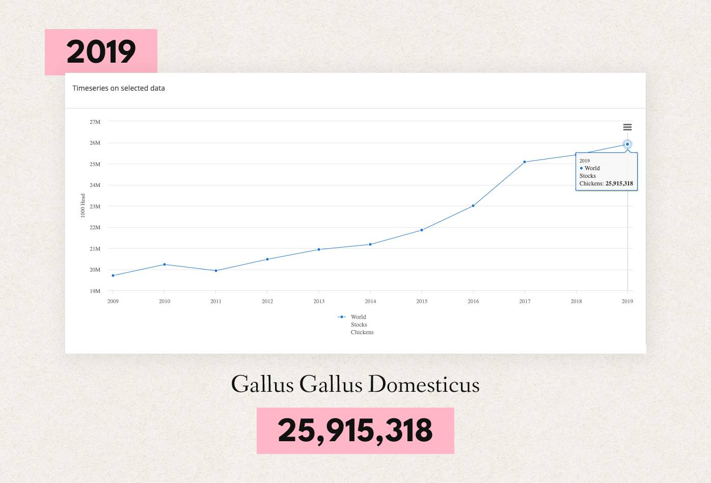
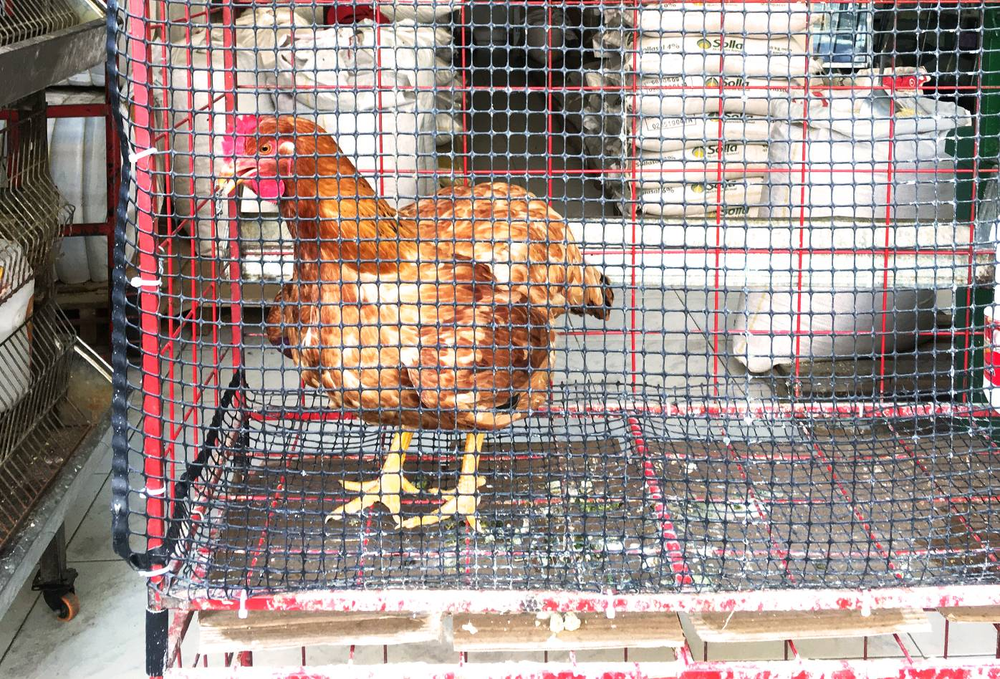
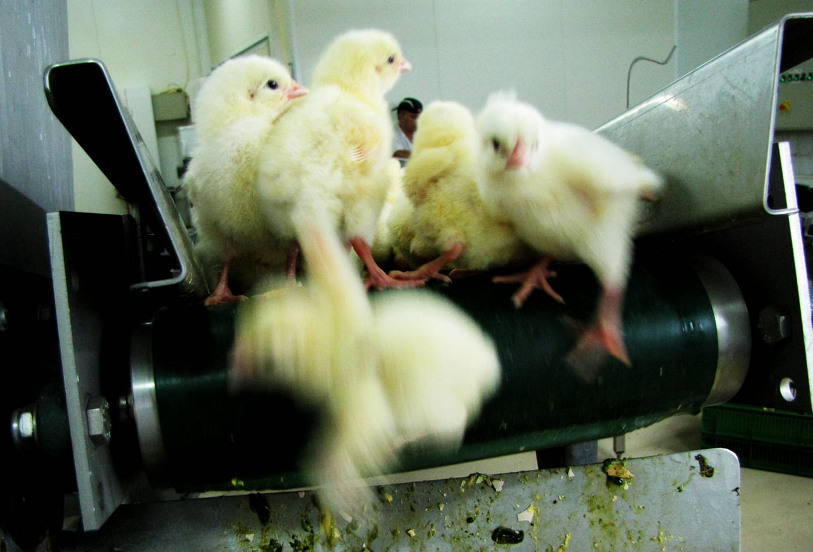
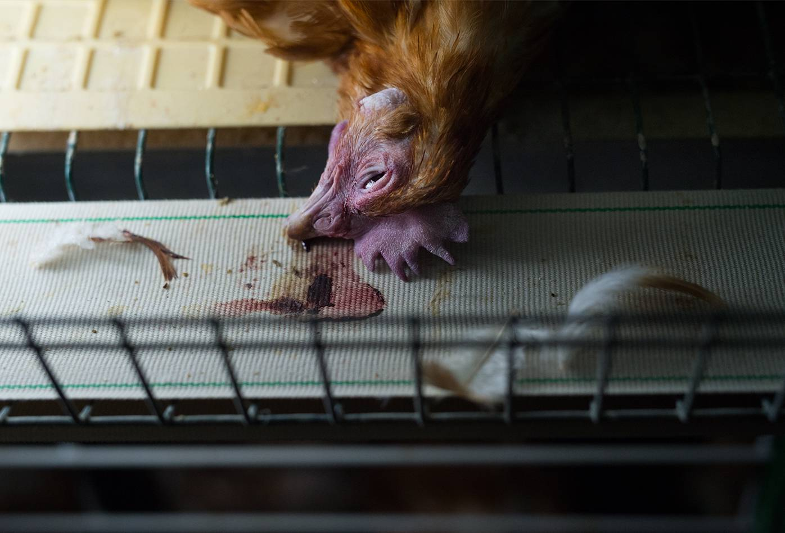
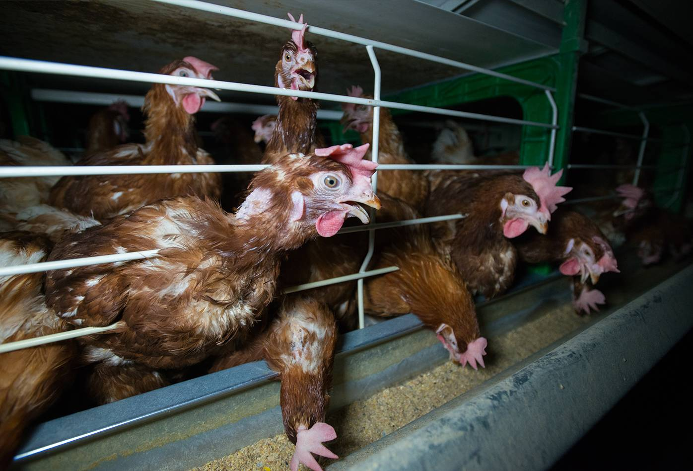

   Este artículo contiene imágenes de víctimas de violencia.

Las gallinas son descendientes de aves que sobrevivieron al cataclismo que extinguió a los dinosaurios hace unos 66 millones de años. Pertenecen a la especie *Gallus Gallus Domesticus*, producto de la domesticación de ejemplares de la especie *Gallus Gallus* y posiblemente cruces con especies cercanas aproximadamente hace 7400 años. Actualmente existen 25 billones de gallinas y gallos domesticades, siendo la especie de vertebrados más abundante en el planeta debido a la intervención humana como colonizadores de sus cuerpos y aparatos reproductivos con fines comerciales. Como en cualquier otro caso de explotación animal, los intereses de estas aves no son tenidos en cuenta y su bienestar depende únicamente del beneficio comercial de les propietaries.

[Población mundial de Gallus Gallus Domesticus en 2019・FAOSTAT・Food and Agriculture Organization of the United Nations](http://www.fao.org/faostat/en/#compare){:target='_blank' class="caption"}

Las gallinas y gallos son aves con vidas sociales complejas, personalidad, habilidad para formar amistades y capacidad para la curiosidad, que viven en bandadas y se organizan en jerarquías con las que determinan el acceso a comida, sitios para anidar, parejas y recursos. Sus capacidades cognitivas son equivalentes a las de los mamíferos, incluyendo primates.

Libres de explotación, su expectativa de vida estaría entre 8 y 15 años, mientras que como productos de la industria su expectativa de vida está entre menos de un día, unos cuatro meses o unos dos años.

[Ave muerta en una granja industrial・Jo-Anne McArthur・Animal Equality](https://www.weanimalsarchive.org/#/gallery/40;imageid=3718){:target='_blank' class="caption"}

Al igual que cualquier otra ave, las gallinas ponen huevos como parte de su ciclo reproductivo, la puesta de huevos es estimulada por alargamientos en el tiempo de luz solar, en los meses más cálidos. Si no están siendo explotadas, las gallinas que no han sido criadas selectivamente para aumentar su producción de huevos, pondrían un huevo cada 24 o 48 horas hasta que llenen sus nidos con entre 10 y 15, que si están fertilizados los incubarían durante 21 días, tomando pequeños descansos para alimentarse y darse baños de tierra con los que se libran de parásitos externos. En la actualidad las gallinas en la industria pueden poner hasta 294 huevos al año debido a la crianza selectiva, manipulación lumínica, y a que las gallinas nunca pueden completar su nido porque los huevos son removidos dos veces al día. Producir un huevo implica usar una cantidad considerable de calcio, por lo que las gallinas ponedoras sufren con frecuencia de osteoporosis grave que les causa sufrimiento y acorta sus vidas.

[Gallina como mercancía en una tienda de insumos en San Gil Santander・Fluorescente](https://fluorescente.design/){:target='_blank' class="caption"}

### Industria del huevo en Colombia

El material de apoyo para zootecnistas es una buena fuente de información para entender cuáles son las prácticas estándar en la industria local. En este caso consultamos el [Manual de gallinas ponedoras](https://fdocuments.es/document/manual-de-gallina-ponedora-sena.html){:target='_blank' class="link"} del Servicio Nacional de Aprendizaje.

#### Sistemas de producción avicola

Hay tres sistemas, el extensivo o tradicional (pastoreo o traspatio), el semi intensivo y el intensivo. El más rentable y recomendado es el intensivo con aves encerradas en galpones. Pueden estar en jaulas o en el piso, pero en todo caso la idea es tener la mayor cantidad de gallinas posible por metro cuadrado para optimizar el espacio. De 4 a 6 ponedoras o de 10 a 12 pollos. En este sistema se somete a los animales a hasta 17 horas de luz artificial para incrementar la producción de sus cuerpos.

[Polluelos a punto de ser triturados por una máquina・"Sacrificio" de pollos・Anónimos por los Derechos de los Animales](https://www.flickr.com/photos/animal_il/8144748206/){:target='_blank' class="caption"}

#### Asesinato de polluelos

A punta de crianza selectiva se han producido diferentes razas de gallinas que se venden para fines distintos. Para carne, ponedoras y de doble propósito. Independientemente del sistema de producción, si se usan gallinas ponedoras, se sigue una práctica estándar llamada “Sacrifico de polluelos - *Chick culling*” para evitar criar pollos macho que no producen huevos y que por su raza no engordan lo suficiente para que sea rentable venderlos para carne. Los métodos para asesinar polluelos poco después de nacer son: Ahogamiento (tirarlos a bolsas de basura y cerrar las bolsas), trituración, cámara de gas, electrocución y luxación cervical.

[Gallina yace muerta en una cinta transportadora de huevos・Jo-Anne McArthur・Animal Equality](https://www.weanimalsarchive.org/#/gallery/40;imageid=9484){:target='_blank' class="caption"}

#### Despique

A no poder vivir en libertad, ni según la organización social propia de su especie, las aves se estresan, se atacan y devoran entre ellas. Para evitar pérdidas económicas, les productores suelen cortar los picos de las gallinas a partir de los 6 u 8 días de edad, con cuchillas a unos 800 grados de temperatura. El corte se realiza sin anestesia, a unos dos milímetros de las fosas nasales, en una zona llena de terminales nerviosas. El despique puede generar un dolor crónico severo, y en casos de mala práctica, infecciones crónicas o el sellamiento del pico, que causa la muerte por inanición. El procedimiento se repite a las 9 o 10 semanas.

#### Fases de vida de las gallinas ponedoras

- Cría: 8 semanas
- Levante: 8 a 18 0 19 semanas
- Producción: desde la semana 18 o 19 hasta la 80. Producción de huevos por 57 a 60 semanas. (se puede "desechar" la ponedora durante ese período por disminución de la producción)

Las gallinas que dejan de ser productivas son vendidas para la producción de sopas de gallina y alimento para mascotas.

### El mito huevo como fuente de proteína accesible para personas de bajos recursos

En la lección anterior aprendimos que podemos obtener la cantidad necesaria de proteínas sin consumir cadáveres o secreciones, y que podemos alimentarnos muy bien con un presupuesto limitado, sin embargo la industria avícola con su poder mediático y presupuesto para contratar agencias de publicidad, más la ayuda de instituciones académicas y gubernamentales han posicionado el mito del huevo como fuente de proteína accesible para gente necesitada. En Colombia el arroz con huevo es un símbolo de la clase trabajadora porque es lo que se come cuando no hay mercado. En el canal de Youtube [Estrato Medio,](https://www.youtube.com/channel/UCuekDajifVRHHSsju_EaKZA){:target='_blank' class="link"} en donde por lo demás hay un muy buen trabajo de análisis de la actualidad nacional, les creadores de contenido promueven este símbolo sin tener en cuenta que el huevo es producto de la explotación, tortura y asesinato de animales que sienten y valoran sus vidas igual que nosotros.

La industria avícola obviamente está defendiendo sus intereses económicos y no tiene ninguna consideración con la clase trabajadora. Les mismos productores en sus documentos internos reconocen que el huevo contiene cantidades alarmantes de grasa saturada y colesterol que no saben cómo reducir, y que al consumir huevo, el riesgo de enfermar por salmonela es considerable. El doctor Gregger trae un caso muy diciente sobre las restricciones que el Departamento de Agricultura de Estados Unidos *USDA* aplica sobre el Comité del huevo *American Egg Board* para evitar que las corporaciones avícolas publiquen publicidad engañosa con dineros públicos. Básicamente no pueden decir que los huevos son saludables, nutritivos, seguros para consumir, ni que son un alimento rico en proteína. Recuerden activar los subtítulos en Español.

<iframe src="https://www.youtube.com/embed/-G-P9zWgSt4" frameborder="0" allow="accelerometer; autoplay; clipboard-write; encrypted-media; gyroscope; picture-in-picture" allowfullscreen></iframe>

[¿Quién dice que los huevos no son saludables ni seguros?・Nutrition Facts](https://nutritionfacts.org/video/flashback-friday-who-says-eggs-arent-healthy-or-safe/){:target='_blank' class="caption"}

### El mito de las gallinas felices

En tiendas ecológicas y supermercados, se comercializan huevos de "gallinas felices". Una etiqueta que tranquiliza la conciencia de les consumidores y permite que el producto tenga un valor más alto. Esta etiqueta es engañosa porque la principal motivación no es la "felicidad" de los animales explotados sino mejorar la reputación de les productores y supuestamente la calidad del producto. En una granja de "gallinas felices", las gallinas tienen acceso a espacios al aire libre, una cama de paja, su alimentación está basada en restos de comida más lo que puedan encontrar pastoreando y en algunos casos cuidos catalogados como ecológicos. Ahi termina la diferencia porque el resto de prácticas se mantienen. Despique, asesinato de polluelos y "descarte" de las gallinas que van disminuyendo su producción. Este sistema es insostenible para satisfacer la demanda porque por cada gallina se requiere de un metro cuadrado.

<iframe src="https://www.youtube.com/embed/dgUFCejv0Lg" frameborder="0" allow="accelerometer; autoplay; clipboard-write; encrypted-media; gyroscope; picture-in-picture" allowfullscreen></iframe>

[Gallinas en Pastoreo, Sistema Gallina Feliz・TvAgro](https://www.youtube.com/watch?v=dgUFCejv0Lg){:target='_blank' class="caption"}

En este video nos muestran "gallinas felices" con el pico mutilado y nos cuentan que la "duración" de las aves es dos años y unos meses de producción.
{: class="caption-no-link after-caption-link"}

### Algunos datos sobre la historia de la industria avícola

Durante el siglo XIX, la mayoría de gallinas y gallos domesticades vivían pequeñas bandadas en granjas locales o patios. Cuando creció el interés comercial también creció el interés por estandarizar la industria. En 1873 se fundó la *American Poultry Association,* para promover estándares para criar gallinas y otras aves domesticadas. La asociación se convirtió eventualmente en lugar para exhibir ejemplares pura sangre, mientras la industria se enfocó en criar híbridos para maximizar la producción.

Las granjas más grandes estaban limitadas por la necesidad de permitirle a las aves acceso al sol porque las gallinas criadas sin acceso a la luz ultravioleta desarrollaban “debilidad en las piernas”. En los inicios de los años veinte, se descubrió que agregar vitamina D a sus dietas prevenía la enfermedad, permitiendo confinar a las gallinas a una vida sin luz solar.

En 1932 se publica el libro *“Battery Brooding”* de Milton H. Arnt. Un manual para la crianza de gallinas en jaulas.

[Gallinas en jaulas en una granja industrial・Jo-Anne McArthur・Animal Equality](https://www.weanimalsarchive.org/#/gallery/40;imageid=9505){:target='_blank' class="caption"}

Durante 1946, la USDA junto con A&P Grocery Company y otros socios en la industria trabajaron para promocionar un concurso nacional de crianza de gallinas para crear una raza que produzca más pechuga con la menor cantidad de alimento posible y probar su viabilidad en periodos de dos años.

En 1951 la FDA aprueba el uso de antibióticos en la crianza de aves. Tras la preocupación por una posible escasez de comida luego de dos guerras mundiales, en 1950, investigadores de la compañía *American Cyanamid*, probando los resultados de incluir vitamina B12 en el alimento de las gallinas, accidentalmente incluyeron un lote con el antibiótico Aureomicina del que la vitamina se producía. Las aves crecieron 50% más rápido y en el año siguiente se aprobó el uso del antibiótico como un estimulante de crecimiento.

En 1954 se funda el *National Chicken Council* para influenciar las políticas y promover la producción de gallinas para carne, en 1976, se crea el *American Egg Board* para posicionar los huevos de gallina como proteína “saludable” y parte de la canasta familiar básica. Durante 1960 y 2019 el consumo de pollo se triplicó.

La práctica de matar a los polluelos recién nacidos se popularizó durante los sesenta cuando se desarrollaron razas especializadas.

### Referencias

- [Chicken・Britanica・https://www.britannica.com/animal/chicken](https://www.britannica.com/animal/chicken){:target='_blank' class="reference"}
- [Facts & Stats・United Eggs Producers・https://unitedegg.com/facts-stats/](https://unitedegg.com/facts-stats/){:target='_blank' class="reference"}
- [Evolution of U.S. Egg Farming・United Eggs Producers・https://unitedegg.com/about/evolution-of-u-s-egg-farming//](https://unitedegg.com/about/evolution-of-u-s-egg-farming//){:target='_blank' class="reference"}
- [Chickens・Farm Sanctuary・https://www.farmsanctuary.org/chickens/](https://www.farmsanctuary.org/chickens/){:target='_blank' class="reference"}
- [Battery Brooding・Milton H Arndt・https://babel.hathitrust.org/cgi/pt?id=coo.31924003197419&view=1up&seq=9](https://babel.hathitrust.org/cgi/pt?id=coo.31924003197419&view=1up&seq=9){:target='_blank' class="reference"}
