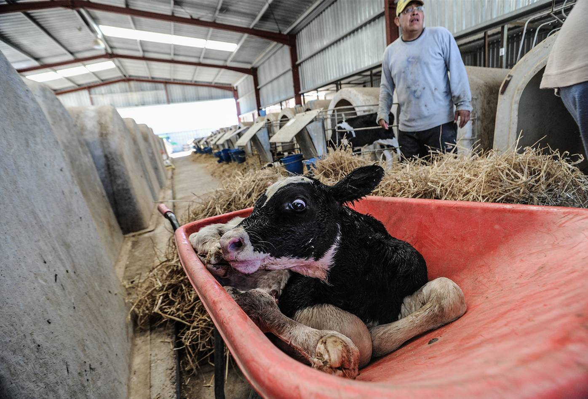
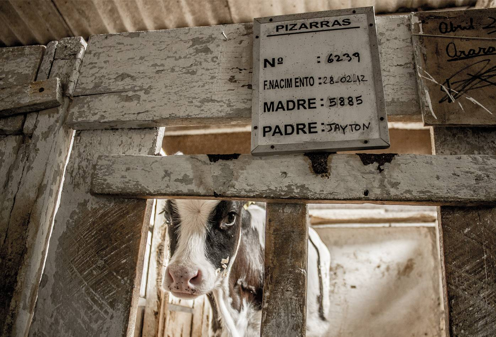
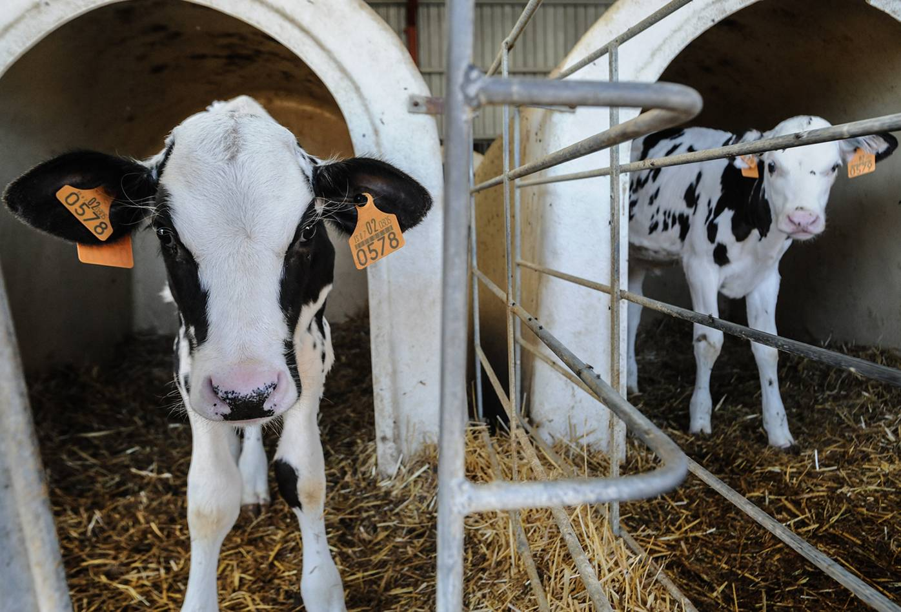
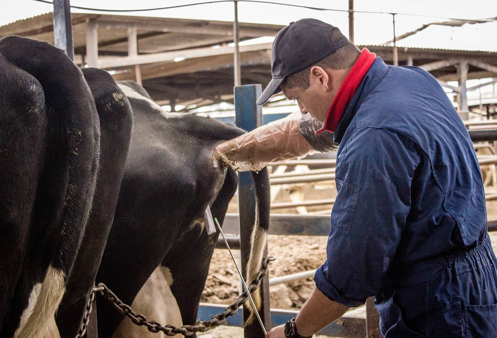
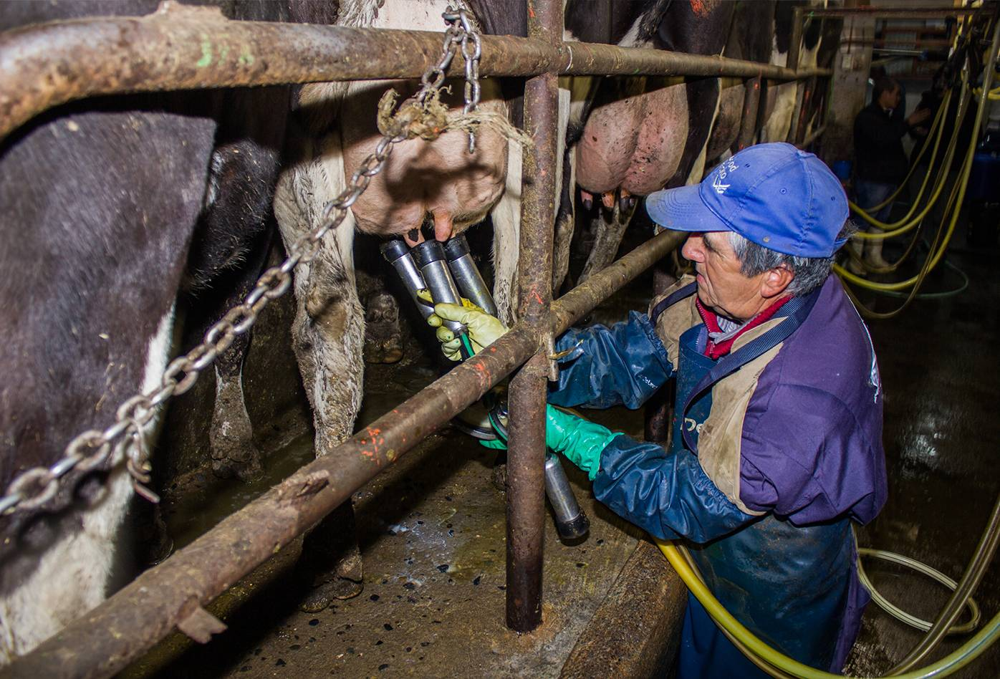
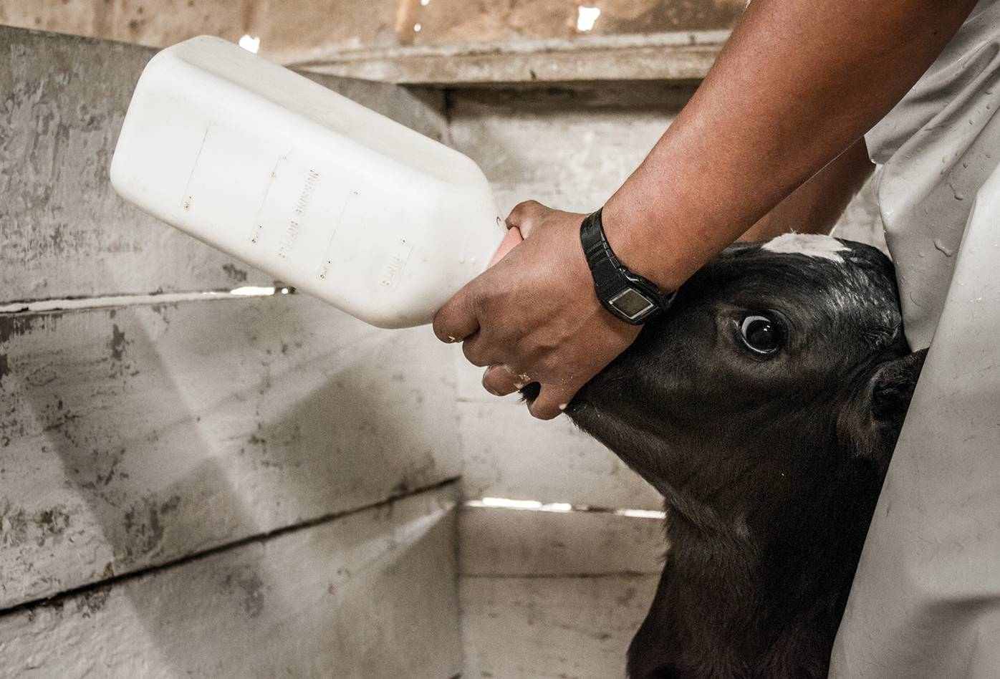

 Este artículo contiene imágenes de tortura y abuso sexual.

Vacas y toros domesticados pertenecen a la especie _Bos Taurus,_ son animales sociales que interactúan de maneras complejas y pueden desarrollar relaciones colaborativas. En libertad podrían pasar el tiempo paseando, buscando comida, socializando y masticando, son animales curiosos y dedican más tiempo cuidando a integrantes de sus manadas que tengan heridas o enfermedades que a quienes estén bien. La especie _Aurochs,_ de donde viene la especie _Bos Taurus,_ fue domesticada hace unos diez mil años cerca de lo que ahora es la India y criada selectivamente hasta llegar a las razas cebú _Taurus Indicus_ modernas. Otras poblaciones fueron domesticadas en el Medio oriente y Asia, creando las razas taurinas o "sin joroba" de hoy _Taurus Taurus._

Como cualquier especie de la clase mamífero, las vacas producen leche cuando paren una cría, y la leche es para alimentarle. Una vaca o una cabra propiedad de humanos tiene el sistema reproductivo colonizado y transformado en una máquina que produce leche para la venta. La clave del negocio es que el animal produzca la mayor cantidad de leche posible durante su vida, y para lograr ese objetivo es necesario someterle a cuantos embarazos resista que serían entre cinco y ocho, usualmente por medio de inseminaciones artificiales. En nuestra cultura esta práctica no se percibe como un acto de bestialismo y abuso sexual sino como un procedimiento normal. También es importante evitar que las crías consuman la leche que el cuerpo de sus madres produjo para alimentarles y esto no se percibe como un robo sino como producción legítima.

El semen que se usa para la inseminación artificial es extraído de toros que son masturbados por humanos en otro acto de bestialismo y abuso sexual normalizado. La crianza selectiva con objetivos económicos tiene como resultado que de un solo ejemplar genéticamente óptimo desde el punto de vista de la explotación, se preñen a miles de vacas, consiguiendo "aumentar la calidad del ganado" pero afectando la variedad genética de una especie que ha sido modificada drásticamente tras milenios de crianza selectiva.

En libertad y un entorno natural, las vacas pueden vivir hasta veinte años, mientras que como productoras de leche, sus cuerpos desgastados tienden a disminuir la producción de leche hacia los cinco años cuando son consideradas "de descarte" y enviadas al matadero para ser asesinadas y vender su carne como hamburguesas.

En un período que varía entre algunas horas y tres días después de nacer, las crías son separadas de sus madres en un evento emocionalmente devastador para animales sociales con vínculos afectivos fuertes. Madres y crías lloran de desesperación por varios días y noches después de la separación. Las crías no pueden obtener los nutrientes directamente de la leche de sus madres y son alimentadas con sustitutos y/o leche residual. En algunas ocasiones se enferman, comen menos, pierden peso y lloran tanto que sus gargantas se irritan y se inflaman.

Cuando se deja a las crías más tiempo con sus madres en un intento por minimizar el sufrimiento de la familia, el vínculo afectivo se refuerza y la separación es todavía más dolorosa.

[Todavía mojado de nacimiento, un ternero es alejado de su madre a las jaulas de terneros en una lechería en España ・Jo-Anne McArthur・Animal Equality / We Animals Media](https://stock.weanimalsmedia.org/search/?searchQuery=dairy+spain&assetType=default){:target='_blank' class="caption"}

Las hembras son criadas para repetir el ciclo de sus madres y los machos al no tener valor para la industria de la leche son vendidos para ser levantados y asesinados por su carne de "ternera".

[Ternera confinada en aislamiento en una lechería en Chile, asoma su cabeza, arriba del corral se ve una pizarra con su número de identificación y el nombre de su padre・Gabriela Penela・We Animals Media](https://stock.weanimalsmedia.org/search/?searchQuery=dairy+chile&assetType=default){:target='_blank' class="caption"}

## La industria de la leche de vaca en Colombia

Algunos procedimientos estándar de la industria ganadera en Colombia según el _Módulo de manejo bovino_ de Fedegán, el _Método integral para la gestión de la producción de lechería especializada, en el trópico alto cundinamarqués_ del SENA, más las Cartillas _Ordeño manual_ y _Ordeño con equipo mecánico, e Inseminación artificial_ del SENA, la revista _Laguna Lechera_ los sitios web _Contexto Ganadero_ y _Producción Animal_

### Identificación

Para trazar a los ejemplares es necesario identificarles de manera que se sepa el año y la temporada de su nacimiento, si es macho o hembra y el número que les corresponde dentro de la explotación. La identificación se realiza a partir de marcas usando diferentes técnicas.

#### Tatuaje

Se usan unos dados con una serie de agujas con los números del cero al nueve, y una pinza para marcar la parte interna de la oreja de la cría, entre los dos días y los cinco meses de nacimiento. Si se ejerce demasiada presión se pude llegar a desgarrar las orejas o las agujas pueden pegarse a las orejas.

[Terneros en "cajones de terneras" en España ・Jo-Anne McArthur・Animal Equality / We Animals Media](https://stock.weanimalsmedia.org/search/?searchQuery=dairy+spain&assetType=default){:target='_blank' class="caption"}

#### Orejera o chapeta

Una placa plástica que se cuelga de la oreja y es aplica perforando la oreja del animal. La orejera puede enredarse en cercas y rasgar sus orejas.

#### Placa metálica

Una placa que se dobla sobre la piel de la oreja.

<iframe src="https://www.youtube.com/embed/RasYxu8ewr4" frameborder="0" allow="accelerometer; autoplay; clipboard-write; encrypted-media; gyroscope; picture-in-picture" allowfullscreen></iframe>

[Marcación mediante hierro caliente・Ganadería Colombia S.A.](https://www.youtube.com/watch?v=RasYxu8ewr4){:target='_blank' class="caption"}

#### Hierro candente

Es la forma más utilizada en el país. Se quema la piel del animal con hierros al rojo vivo para dejar grabados sus números y símbolo de la hacienda a la que pertenecen. Se recomienda no hacerlo en el lomo porque se deteriora la piel para la industria de marroquinería y calzado, y tener cuidado de quemar únicamente la parte externa de la piel porque al quemar la parte profunda pueden aparecer gusaneras y manchas que dificultan la lectura. Un patrón fácil de reconocer dentro de estos manuales de zootecnia es que no se tiene en cuenta el sufrimiento del animal a menos que este sufrimiento dañe el producto final, cuando se mencionan prácticas para mejorar el bienestar de los animales, la finalidad de ese bienestar no es reducir el sufrimiento sino mejorar la calidad de los productos y aumentar el beneficio económico por medio del mercadeo que responde a tendencias de consumo "consciente".

#### Marca fría

Se aplica un hierro enfriado en nitrógeno líquido para que cuando el pelo salga de nuevo sea de color blanco y se noten los números. La técnica no es muy utilizada en el país probablemente debido a su alto costo y a que únicamente funciona en animales con pelo oscuro.

#### Microchips

Se perforan las orejas del animal con un botón que contiene un microchip y una placa plástica con unos números y un código de barras. El botón se puede cambiar por un bolo intrarumial que se le hace tragar al animal usando una pistola diseñada para este fin.

### Desbotone

Para evitar que las novillas desarrollen sus cuernos y se puedan manejar más fácilmente, entre los tres y catorce días de nacimiento, o tan pronto aparece el botón, yema o rudimento del cuerno, se realiza el desbotone o topización por medio de cauterización o la destrucción química. Los procedimientos son dolorosos y se recomienda aplicar anestesia local. Algunas razas son modificadas genéticamente para que crezcan sin cuernos.

#### Topización por medio de calor

Se razura la zona alrededor del cuerno, se lava y desinfecta, luego se corta con una navaja o un bisturí desinfectado el corión del botón de crecimiento del cuerno y se cauteriza con un cautín o descornador eléctrico sobre la yema de crecimiento para destruirla y atrofiar el crecimiento del cuerno.

#### Topización química

Se aplica sobre el botón de del cuerno una pasta desconradora a base de cáusticos como hidróxido de sodio y de calcio. Durante el procedimiento se corre el riesgo de que la pasta se escurra a los ojos y los destruya.

### Descornado

Si el crecimiento de los cuernos no se atrofia en las primeras semanas, los cuernos se mutilan usando diferentes técnicas. Los procedimientos se realizan con anestesia local.

#### Descornación con la técnica de Barnes

Se mutila el cuerno con un dispositivo llamado _descornador de Barnes_. En ocasiones se puede ocasionar un sangrado profuso que debe tratarse realizando una hemostasia por pinzamiento de la arteria corunal. Se debe proteger la herida contra infecciones.

#### Elastro-amputación

Se comprime la base del cuerno para cortar el suministro sanguíneo para que el cuerno se caiga entre 60 y 86 días.

#### Descorne quirúrgico

Se realiza una operación quirúrgica que permite cortar los cuernos con un serrucho especial.

[Un trabajador insemina artificialmente a una vaca usando la técnica recto vaginal en una lechería en Chile ・ Gabriela Penela・We Animals Media](https://stock.weanimalsmedia.org/search/?searchQuery=dairy+chile&assetType=default){:target='_blank' class="caption"}

### Inseminación

Los toros de las razas usadas para la producción lechera son grandes y agresivos, por lo que mantener toros para montar vacas en celo es más costoso y difícil que la inseminación artificial, siendo esta la forma más común de embarazar a una vaca, además ofrece la ventaja de "mejorar la raza" para obtener ciertas características dependiendo del semen que se adquiera. La inseminación se realiza amarrando a la vaca a un potro de monta e introduciendo la mano izquierda por el recto hasta encontrar el cuello uterino; al encontrarlo se fija con los dedos y se explora el orificio de entrada. Con la otra mano se introduce el catéter por la vulva y se deposita el semen donde termina el cerviz y comienza el útero.

<iframe src="https://www.youtube.com/embed/13Y-oGONdBA" frameborder="0" allow="accelerometer; autoplay; clipboard-write; encrypted-media; gyroscope; picture-in-picture" allowfullscreen></iframe>

[Como Realizar el Proceso de Inseminación Artificial en Bovinos・TvAgro](https://www.youtube.com/watch?v=13Y-oGONdBA){:target='_blank' class="caption"}

Los embarazos de las vacas duran nueve meses y normalmente paren una sola cría. Entre los 6 y 22 meses de nacidas, dependiendo de su raza, son preñadas por primera vez, para continuar pariendo cada 12 o 13 meses durante el resto de sus vidas. Después de cada parto hay un periodo de entre 60 y 115 días antes de repetir el proceso mediante monta o inseminación artificial. A la inseminación se le llama "servicio" y en algunas ocasiones es necesario más de un "servicio" por cada preñez.

### Proceso de producción de leche de vaca

Durante los dos últimos meses de gestación, la vaca es "secada" u ordeñada para detener la actividad de sus glándulas mamarias, optimizar el parto y el principio de una nueva lactancia. En esta etapa se puede presentar la "enfermedad de las vacas caídas" por deficiencia de calcio durante el parto en vacas de alta producción, y se aplican antibióticos intramamarios para evitar la mastitis (inflamación de la glándula mamaria causada por infecciones bacterianas). Esta enfermedad es dolorosa y bastante común entre las vacas manipuladas para producir leche para el consumo humano.

#### Parto y calostro

Desde el parto hasta que la cría es separada de su madre, se deja que la cría mame calostro para que se nutra de anticuerpos y vitamina A.

#### Lactancia

Luego de separarla de su cría, la vaca es integrada a la línea de producción para ser ordeñada dos veces diarias. Desde día primero al cien se presenta el pico de producción que va declinando progresivamente.

[Un trabajador conecta una pezonera a las ubres de una vaca para ordeñarla en una lechería en Chile ・ Gabriela Penela・We Animals Media](https://stock.weanimalsmedia.org/search/?searchQuery=dairy+chile&assetType=default){:target='_blank' class="caption"}

#### Ordeño

Para que las vacas puedan ser ordeñadas es necesario que se estimule su secreción de oxitocina, lavando las ubres con agua tibia y secándolas con un trapo limpio. Si las vacas son estresadas pueden liberar adrenalina y "esconder" la leche.

El ordeño manual puede ser con cría o sin cría. En el caso de ordeño con cría, se deja amamantar a la cría para que inicie la bajada de leche, luego se aparta y se amarra de manera que no pueda alcanzar el pezón de su madre para continuar con el ordeño manual.

El ordeño mecánico es una técnica que se viene usando desde 1870 para incrementar la producción láctea. En algunas granjas modernas se puede secar a más de cien vacas en diez minutos. Para usar esta técnica se conectan las ubres de la vaca a la pezonera de la máquina ordeñadora luego de lavar y masajear las ubres. La máquina que está diseñada para simular la succión de una cría, debe estar conectada unos cinco minutos y nunca más de ocho.

#### Descarte

Las vacas son enviadas al matadero cuando termina su vida productiva o por baja producción, baja fertilidad o enfermedad.

## Ganadería industrial

Independiente del modo de producción lechera, la vida de las vacas está lejos de ser feliz como sostiene descaradamente la publicidad de la industria láctea. En la ganadería industrial sus condiciones de vida son todavía peores. Las vacas pasan sus vidas en pisos de concreto pisando su propio excremento y siendo frecuentemente conectadas a aparatos de ordeño. Durante el 2019, la vaca promedio fue forzada a producir más de diez mil litros de leche, más del doble de la cantidad producida cuarenta años antes. La crianza selectiva con el fin de aumentar la producción a niveles peligrosos para la salud, combinada con el daño en las ubres que producen las máquinas de ordeño, contribuyen con altos niveles de mastitis que a su vez incrementan la presencia de bacterias y hongos en la leche.

Para amplificar la producción de leche y la ganancia económica, en algunas granjas se inyecta a las vacas lecheras con hormona de crecimiento bovino (rBGH, recombinant bovine growth hormone), una hormona genéticamente modificada que incrementa el riesgo de problemas de salud como mastitis y cojera. En algunas lecherías se realiza la práctica del "tail docking" o corte de cola que consiste en remover la cola con un corte o estrangularla con un anillo de caucho hasta que se marchita y se cae. Tanto el corte como el estrangulamiento causa dolor crónico que nunca es atendido. Las vacas que están muy enfermas o heridas para caminar son arrastradas y empujadas al matadero.

[Ternero recién nacido siendo alimentado por un trabajador con una botella, en una lechería en Chile ・ Gabriela Penela・We Animals Media](https://stock.weanimalsmedia.org/search/?searchQuery=dairy+chile&assetType=default){:target='_blank' class="caption"}

## ¿Necesitamos consumir leche de otras especies?

Usualmente las personas no están conscientes de que la leche es un alimento que las madres mamíferas producen para alimentar a sus crías durante su periodo de lactancia. No tiene ningún sentido consumir leche luego de ese período y menos cuando esta leche es de otra especie, sin embargo estamos constantemente expuestos a publicidad que manipula datos nutricionales y tradiciones culturales que nos impiden develar el absurdo y la crueldad detrás de los lácteos.

Puedo mencionar también el mito hinduista de la diosa Kamadhenu, madre de todas las vacas, que a su vez son generosas y nos comparten su leche; el mito explica porque la mayoría de hinduhistas y practicantes de yoga continúan consumiendo lácteos. Aunque los y las hinduistas que han montado restaurantes vegetarianos con opciones veganas prestan un servicio muy valioso, y a pesar de que no dudo de sus buenas intenciones, por apegarse a una creencia religiosa, desinforman a la comunidad y afirman su participación activa en la crueldad contra vacas y cabras.

Contrario a la creencia popular y la de las instituciones gubernamentales que desperdician dinero financiando la ganadería con nuestros impuestos, el consumo de leche de otras especies no solamente es completamente innecesario sino que causa enfermedades que nuestra cultura ha normalizado. En la siguiente lección veremos porque los lácteos son tan perjudiciales para la salud, y en la que sigue después de esa, analizaremos el marketing de la industria y entenderemos porque muchas personas tienen problemas para dejar de consumir.

### Referencias

* [Cow・Britanica](https://www.britannica.com/animal/cow){:target='_blank' class="reference"}
* [Cows・Farm Sanctuary](https://www.farmsanctuary.org/cows/){:target='_blank' class="reference"}
* [Módulo Manejo Bovino・Fedegan](https://es.slideshare.net/Fedegan/cartilla-modulo-manejobovinocc/){:target='_blank' class="reference"}
* [Ordeño Manual・SENA](https://repositorio.sena.edu.co/bitstream/handle/11404/472/vol1_ordeno_manual_op.pdf?sequence=12){:target='_blank' class="reference"}
* [Inseminación Artificial・SENA](https://repositorio.sena.edu.co/bitstream/handle/11404/484/vol4_inseminacion_artificial_op.pdf?sequence=12&isAllowed=y){:target='_blank' class="reference"}
* [Método integral para la gestión de la producción especializada, en el trópico alto cundinamarqués ・SENA](https://repositorio.sena.edu.co/bitstream/handle/11404/5557/gestion_produccion_lechera.pdf?sequence=3&isAllowed=y){:target='_blank' class="reference"}
* [Conozca en qué consiste el proceso de desbotone de un ternero ・Contexto Ganadero](https://www.contextoganadero.com/ganaderia-sostenible/conozca-en-que-consiste-el-proceso-de-desbotone-de-un-ternero){:target='_blank' class="reference"}
* [Descorne en bovinos・Laguna Lechera](https://www.contextoganadero.com/ganaderia-sostenible/conozca-en-que-consiste-el-proceso-de-desbotone-de-un-ternero){:target='_blank' class="reference"}
* [Descorne zootécnico y quirúrgico en bovinos・Producción Animal](https://www.contextoganadero.com/ganaderia-sostenible/conozca-en-que-consiste-el-proceso-de-desbotone-de-un-ternero){:target='_blank' class="reference"}
