

 Este artículo contiene imágenes violentas y sangrientas.

Cerdas y cerdos pertenecen a la especie _Sus Scrofa Domesticus_, mamíferos artilodáctilos de la familia _Suidae_. La domesticación de esta especie se origina en China y el Medio Oriente hace unos 10.000 años, sin embargo cuenta con una mezcla genética variada, como resultado de constantes cruces con jabalíes salvajes.

Cuando las condiciones de vida permiten su desarrollo neuronal, son animales sociales y alegres. Corren, juegan, se relajan, se acurrucan, y se revuelcan en el lodo para refrescarse debido a que no tienen glándulas sudoríparas. Quienes han pasado tiempo con animales de esta especie saben que no son muy diferentes a perras y perros con quienes solemos compartir nuestras vidas. Son emocionalmente sensibles, les gusta jugar, muestran curiosidad, y disfrutan de bocadillos y mimos. Su expectativa de vida en libertad es de unos diez a quince años, mientras que en cautiverio sus vidas son arrebatadas en unos dos años.

Esta especie es activa e inteligente. Participan en sus mundos de manera similar a otros animales complejos, poseen un entendimiento sofisticado de sus alrededores, navegan eficientemente, recuerdan y anticipan experiencias, y disfrutan de su vida a través del juego.

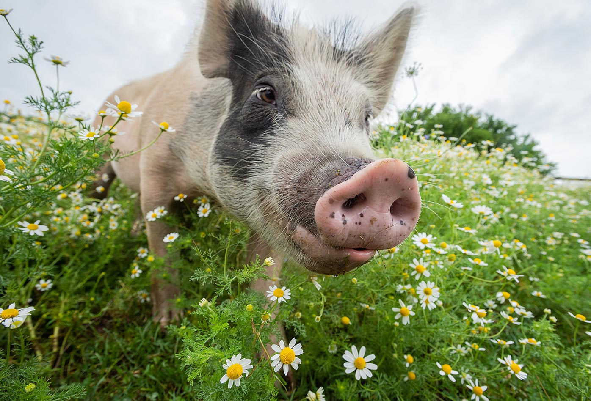
[Un cerdo rescatado en pastos llenos de manzanilla・Jo-Anne McArthur / We Animals Media](https://stock.weanimalsmedia.org/search/?searchQuery=WAM7560&assetType=default){:target='_blank' class="caption"}

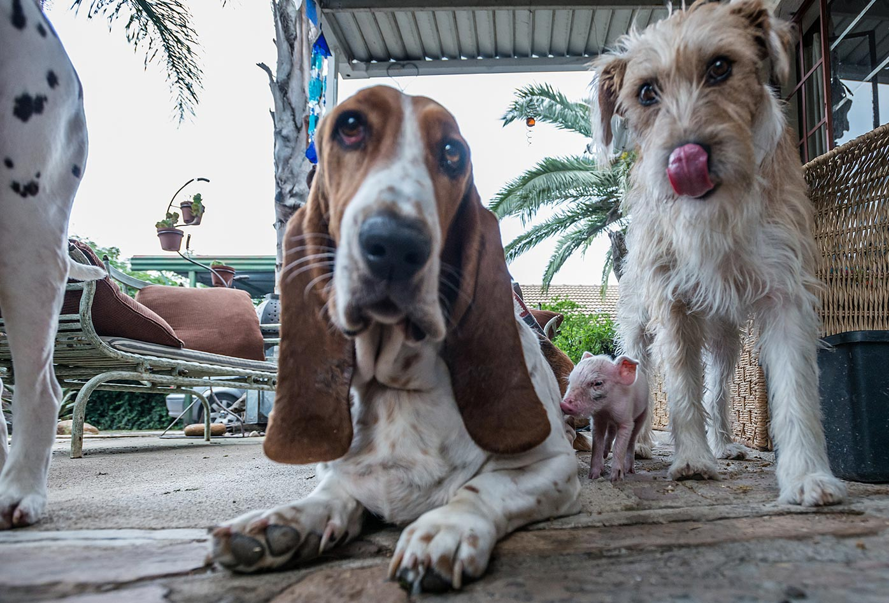
[Una cerdita recién rescatada está parada entre dos perros en el santuario en Johannesburgo que será su nuevo hogar・Jo-Anne McArthur・#unboundproject / We Animals Media](https://stock.weanimalsmedia.org/search/?searchQuery=WAM5750&assetType=default){:target='_blank' class="caption"}

>“Por medio de investigaciones no invasoras, encontramos que una cerda o un cerdo no son tan diferentes a una gata o un perro con quienes compartimos nuestros hogares, es más, posiblemente no son tan diferentes a nuestra especie. Hemos mostrado que cerdas y cerdos comparten una cantidad de capacidades cognitivas con otras especies como perros, chimpancés, elefantes, delfines e inclusive humanos. Hay buena evidencia científica para sugerir que necesitamos volver a pensar nuestra relación con estas especies.”
> {: class="p-big"}

[Dr. Lori Marino. Neurocientífica y experta en comportamiento animal e inteligencia. - Universidad Emory. (Traducción aproximada)](https://assets.farmsanctuary.org/content/uploads/2016/06/27062338/TSP_PIGS_WhitePaper_vF_2.pdf){:target='_blank' class="caption"}

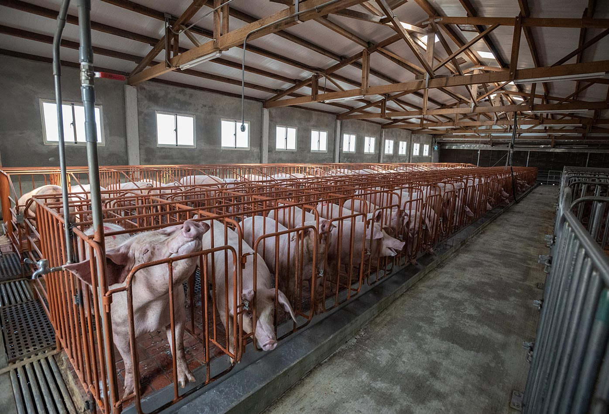
[Cerdas y cerdos en una granja industrial recién construida・Jo-Anne McArthur・We Animals Media](https://stock.weanimalsmedia.org/search/?searchQuery=WAM266&assetType=default){:target='_blank' class="caption"}

>“Los animales en zootecnia se consideran máquinas y tienen que dar determinado rendimiento según se les instale, alimente cuide y maneje. Una máquina que no da rendimiento, dañada o vieja, se elimina. Tienen que producir más de lo que consuman en alimentación y cuidados; un animal viejo, enfermo o que no produce se elimina y se vende.”
> {: class="p-big"}

[Manual de Porcinos. Sitio Argentino de Producción Animal, Dirección de Educación Agraria, Dirección Provincial de educación técnico profesional. Provincia de Buenos Aires.](https://www.produccion-animal.com.ar/produccion_porcina/00-produccion_porcina_general/160-MANUAL_DE_PORCINOS.pdf){:target='_blank' class="caption"}

## La industria de la carne de cerdo en Colombia

Datos relevantes para la industria sobre características de los cuerpos de cerdas y cerdos, y algunos procedimientos estándar de la industria ganadera según el [_Manual de producción porcícola_](https://repositorio.sena.edu.co/bitstream/handle/11404/4270/porcinos_2005.pdf?sequence=1&isAllowed=y){:target='_blank' class="link"} del Servicio Nacional de Aprendizaje (SENA), y la cartilla [_Gestión integral en la producción porcina_](https://repositorio.sena.edu.co/sitios/gestion_produccion_porcina){:target='_blank' class="link"} de la misma entidad.

### Selección de animales para criar

Los animales son seleccionados según criterios de retorno de inversión, entre diversas razas desarrolladas a partir de la crianza selectiva. Los machos se destinan para reproducción entre siete u ocho meses cuando pesan entre 110 y 120 kilogramos, y para escoger las hembras la edad es de cinco a siete meses cuando pesan entre 100 y 110 kilogramos.

### Ciclo reproductivo

El ciclo de gestación de una cerda es de aproximadamente 115 días. Posteriormente lacta durante unos 49 a 63 días, cuando se realiza el destete. Se dejan recuperar durante siete días, momento en el que entra en celo de nuevo, y es inseminada por el reproductor, o artificialmente. Si no queda preñada se repite el "servicio" en 21 días. A partir del sexto parto disminuye el tamaño de la camada.

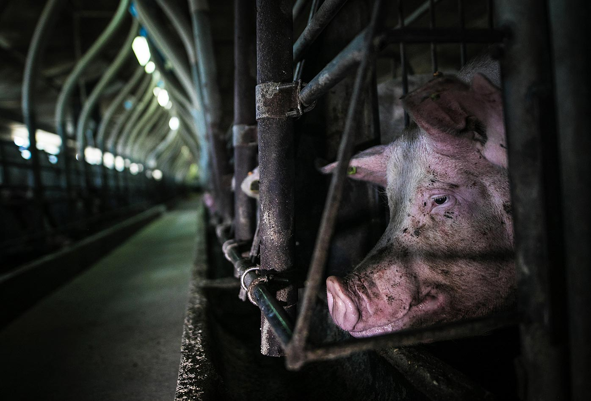
[Una cerda en una jaula de gestación, antes de ser inseminada. Confinadas en estas jaulas, las cerdas únicamente pueden pararse o acostarse, no pueden voltearse・Andrew Skowron / We Animals Media](https://stock.weanimalsmedia.org/search/?searchQuery=WAM15932&assetType=default){:target='_blank' class="caption"}

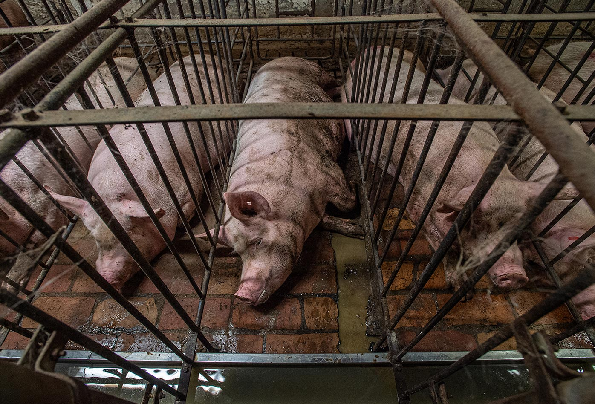
[Una cerda preñada yace en un suelo con heces y orina, en una jaula en la que no puede darse vuelta, en una granja industrial del norte de Italia, donde miles de cerdas viven en estas condiciones・Jo-Anne McArthur / Essere Animali / We Animals Media](https://stock.weanimalsmedia.org/search/?searchQuery=WAM4917&assetType=default){:target='_blank' class="caption"}

Durante la gestación, las cerdas son estabuladas en corrales de piso de concreto, o jaulas de gestación de 0,6 metros de ancho por 2,1 metros de largo. Un poco más grandes que el tamaño de la cerda, por lo que su movimiento está tan limitado que no puede siquiera voltearse. El confinamiento se alterna con potreros de pastoreo, que pueden recibir entre 40 y 50 cerdas por hectárea, dependiendo de las condiciones del pasto.

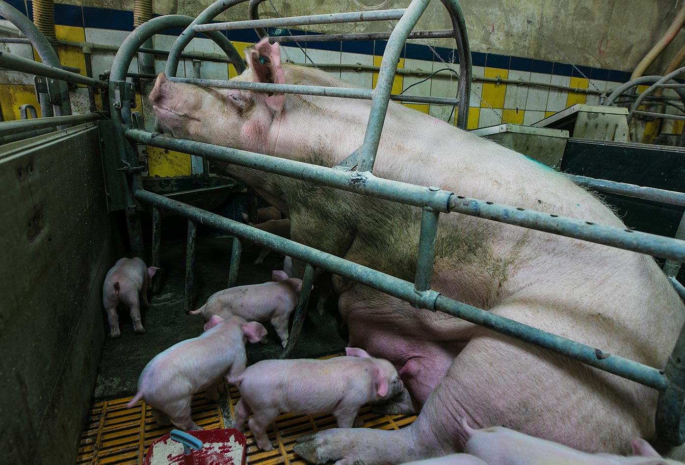
[Una cerda y sus crías en la jaula de parto. Las cerdas no pueden darse la vuelta, sólo pueden levantarse y tumbarse en el suelo・Andrew Skowron / We Animals Media](https://stock.weanimalsmedia.org/search/?searchQuery=WAM15942&assetType=default){:target='_blank' class="caption"}

### Lactancia

Mientras pasa la etapa de lactancia, las cerdas son confinadas en jaulas que constriñen sus movimientos para evitar que aplasten a sus crías accidentalmente o les ataquen. En un periodo de unos dos o tres días, cuando la cerda les acepta, se deja a las crías mamar cada dos horas durante el día y cada tres horas durante la noche.

### Corte de colmillos

Es practicado en camadas grandes, para evitar que las crías lesionen a la madre, o se lesionen mutuamente. Se cortan los ocho colmillos con tijeras, cortafríos o un cortaúñas previamente desinfectado. El corte se realiza cerca de la encía, y se debe tener cuidado para no lastimarla, dejar picos o aristas, o astillar los dientes.

### Corte de cola

Esta práctica se reserva para cocheras en donde se presenta canibalismo, (frecuentemente por estrés). La cola se puede cortar con pinzas o tijeras.

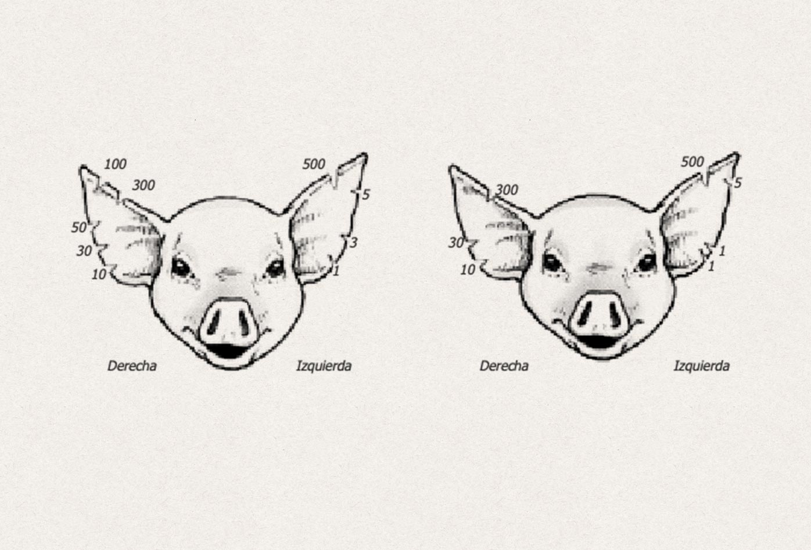
[Ubicación de muescas para identificar cerdos・Manual de producción porcícola・Servicio Nacional de Aprendizaje](https://stock.weanimalsmedia.org/search/?searchQuery=WAM266&assetType=default){:target='_blank' class="caption"}

### Identificación

Para identificar a las crías se usan chapetas, tatuajes o muescas en las orejas. La ubicación de la muesca representa una unidad, decena o centena.

### Castración

Los machos que no son seleccionados para reproducción, son castrados entre los 10 y 15 días de edad, proceso realizado generalmente entre dos personas. Una sujeta al animal de las patas traseras, y la otra ejecuta la operación. Inicia con el lavado y desinfección del escroto con alcohol, o una solución rebajada de creolina, y continúa  con una incisión en la parte anterior del escroto hacia la línea media. A continuación se empuja cada testículo a través de la herida, separándolo de las envolturas y extrayendo una buena sección del cordón espermático que se liga antes de ser cortado, o se raspa para que se rompa sin causar hemorragia. Luego se desinfecta la herida y se controlan signos posteriores de hemorragia.

### Destete

A partir de los 56 días generalmente, las crías son destetadas. La madre es llevada a un corral diferente, y se conserva a sus crías en la misma cochera. En producciones pequeñas, lechonas y lechones se venden al momento del destete si no se cuenta con las instalaciones para engordar a dos o más ejemplares.

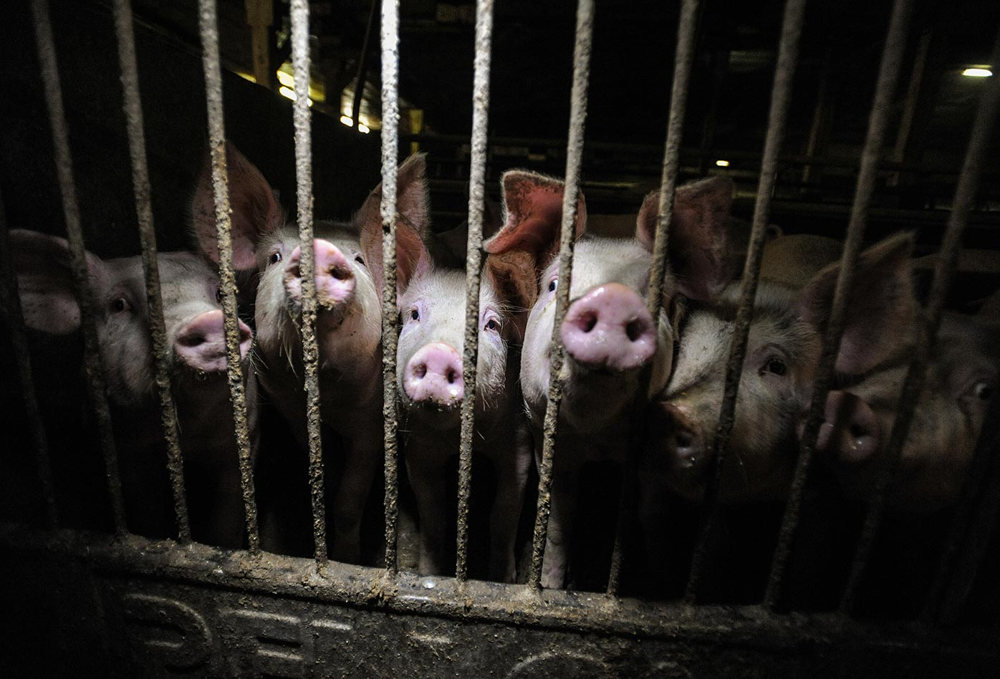
[Cerdas y cerdos en una granja industrial・Jo-Anne McArthur / Oikeutta Elaimille / We Animals Media](https://stock.weanimalsmedia.org/search/?searchQuery=WAM264&assetType=default){:target='_blank' class="caption"}

### Crecimiento y engorde

Se recomienda mantener a los animales en confinamiento en el mismo corral, para controlar más efectivamente las condiciones ambientales, alimentación y sanidad. Con el objetivo de obtener ejemplares con buen peso. Cuando alcanzan el peso indicado se envían al matadero.

### Reproductores

Los cerdos seleccionados para reproducción son alojados en un área de cinco a seis metros cuadrados por macho, y se les permite un área de ejercicio de cien metros cuadrados. En caso de que no tengan área de ejercicio viven entre ocho y diez metros cuadrados.

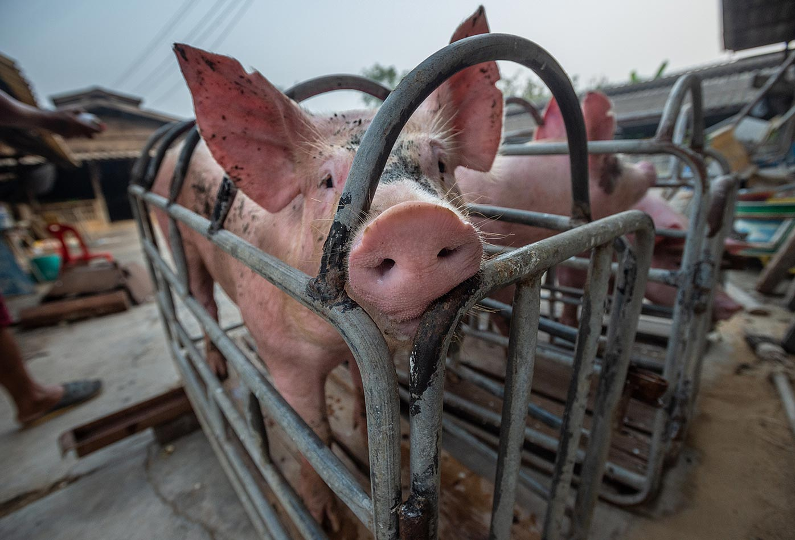
[Carga de cerdos para su transporte en una granja ecológica familiar・Jo-Anne McArthur / We Animals Media](https://stock.weanimalsmedia.org/search/?searchQuery=WAM4014&assetType=default){:target='_blank' class="caption"}

### Venta

Las cerdas y cerdos se venden cuando alcanzan unos 80, 90 o más kilogramos de peso, después de un periodo de engorde prolongado, aproximadamente a sus dos años de vida.

### Asesinato "sacrificio"

#### Selección de la víctima

La salud del ejemplar es evaluada observando su piel, vigor, movimientos, mirada y fosas nasales. Es preferible matar animales relativamente jóvenes, por la calidad de su carne, y que no estén muy gordas o gordos para evitar una cantidad excesiva de grasa, debido a que la demanda por carnes magras es mayor. Según el manual, está prohibido sacrificar animales en mal estado de salud, o con sospecha de enfermedades infecto-contagiosas; aunque si observamos a los animales que llegan a los mataderos, es común encontrar lesiones, tumores y otros indicios de enfermedades.

Es recomendable matar a cerdos castrados debido a que quienes no han sido mutilados dejan un olor desagradable en la carne, que permanece hasta después de ser procesada. En caso de asesinar cerdos sin castrar, deben ser menores de cinco meses de edad. Las hembras se matan siempre y cuando no estén en gestación, lactando, o recuperándose de la lactancia.

Es una mala práctica matar cerdas o cerdos de menos de 70 kilogramos de peso en pié, porque no es rentable.

#### Estabulado

Una vez se selecciona al ejemplar, se separa del resto de la manada y se somete a estabulación. Durante el estabulado es suspendido todo suministro de alimentos durante un tiempo de ayuno que depende de la edad y el tamaño. Por lo general la deprivación es de 24 horas, con suministro de abundante agua.  El ayuno permite facilitar el asesinato y limpieza de las viseras.

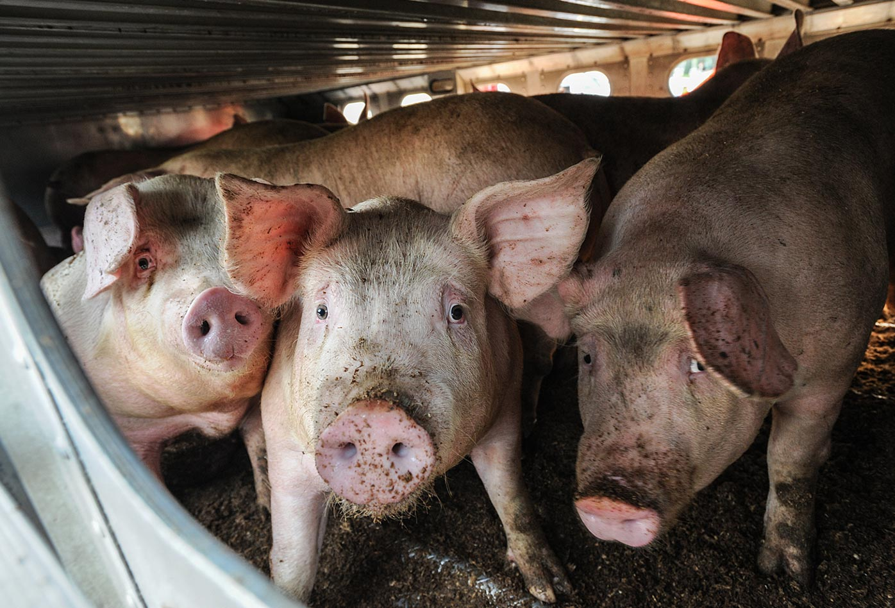
[Cerdas y cerdos en camino al matadero・Jo-Anne McArthur / We Animals Media](https://stock.weanimalsmedia.org/search/?searchQuery=WAM299&assetType=default){:target='_blank' class="caption"}

#### Transporte

Transportar cerdas y cerdos durante el mismo día del asesinato se debería evitar, sin embargo si es necesario llevarles a otro lugar, es recomendable seguir las precauciones pertinentes para impedir golpes y malos tratos que incluyen usar lazos para amarrarles. El manual menciona que los golpes dañan la calidad de la carne porque causan moretones y magullamientos.

#### Pasos del asesinato "sacrificio", y desmembramiento

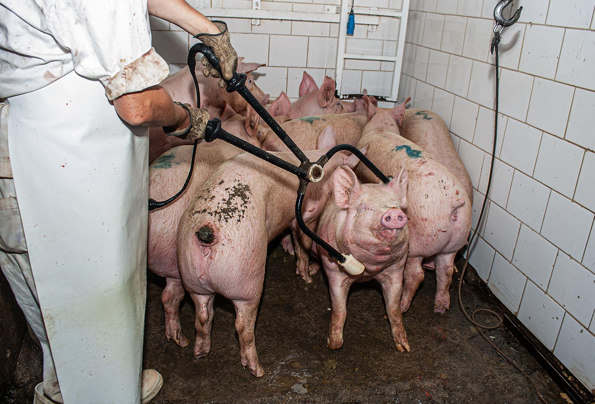
[Un cerdo es agarrado por la cabeza y el cuello y electrocutado mientras el resto del grupo se agazapa en una esquina esperando su turno en un matadero・Gabriela Penela / We Animals Media](https://stock.weanimalsmedia.org/search/?searchQuery=WAM18521&assetType=default){:target='_blank' class="caption"}

##### 1. Supresión de la conciencia

Para facilitar el degollamiento es necesario dejar al animal inconsciente. En mataderos tradicionales ejecutan la supresión mediante un golpe fuerte en el cráneo con un martillo pesado, y en mataderos más actualizados se usa una pistola especial para sacrificio, o un insensibilizador eléctrico.

La pistola expulsa un tornillo en el cráneo que deja inconsciente al animal. Es disparado en la intersección entre las líneas imaginarias que se trazarían entre las orejas y su ojo opuesto.

El procedimiento es violento, doloroso y no siempre funciona. Es frecuente que los animales sigan conscientes cuando se degollan o se acuchillan en el corazón.

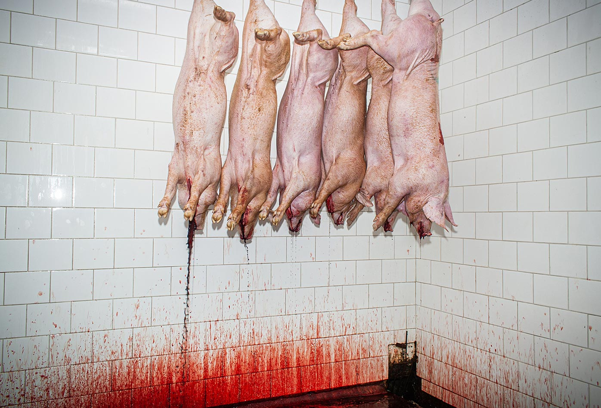
[Seis cerdos cuelgan por las patas desangrándose tras ser degollados en un matadero de Chile・Gabriela Penela / We Animals Media](https://stock.weanimalsmedia.org/search/?searchQuery=WAM18541&assetType=default){:target='_blank' class="caption"}

##### 2. Degüello y sangrado

las venas y arterias del cuello son cortadas con una incisión de 12 a 15 centímetros que va desde el extremo superior del esternón, hasta el centro del cuello, o se hace un corte que llegue directamente al corazón.

El objetivo es que la sangre fluya copiosamente por las degolladuras. Se recoge con un recipiente limpio en el que previamente se ha depositado sal, vinagre y cebolla. Al finalizar el degüello, el recipiente es llevado a un lugar frío y limpio, o a un refrigerador.

##### 3. Depilado y separación de patas

El cadáver es dispuesto sobre una mesa, y se depila con un cuchillo, lavando con agua hirviendo para facilitar el desprendimiento de la epidermis. La temperatura no puede ser demasiado elevada porque puede provocar la cocción de la piel durante el proceso, y que de dicha piel se desprendan pedazos.

La depilación con llama está entrando en desuso porque afecta la calidad de la carne. Después del depilado se separan las patas a la altura de la coyuntura.

##### 4. Enviscerado

Luego de lavar y secar el cadáver, sigue un corte desde la altura del pecho, continuando por el vientre y terminando en en la unión de las piernas. El corte debe realizarse con precaución, para evitar cortar el estómago y los intestinos. El esternón se corta con una sierra.

La sangre acumulada en la cavidad toráxica es extraída, y se deposita en el recipiente de degüello. Se halan la tráquea y esófago hacia atrás, luego es separado el diagragma de los costados y se continúa halando esófago y tráquea llevando corazón, pulmones, hígado, estómago, intestinos, riñones, aparato reproductor, que se depositan en un recipiente, evitando que las vieras se rompan y la carne se contamine con contenido intestinal.

Después de separar y lavar las víceras, se remoja el estómago en agua caliente para desprender mucosas y otras adherencias que le dan una mala presentación a la carne. Para continuar son depositados los órganos en un recipiente con sal, vinagre y suficiente limón para conservarlos hasta que se utilicen. Si no se usan inmediatamente van a un congelador. Finalmente es separada la cabeza del cuerpo, y se lavan y secan cabeza y cuerpo. A cadáveres de cerdas y cerdos sin cabeza, patas y víceras se les llama "canal". La canal se cuelga y se deja en un lugar limpio, frío y ventilado hasta el día siguiente para que enfríe y seque.

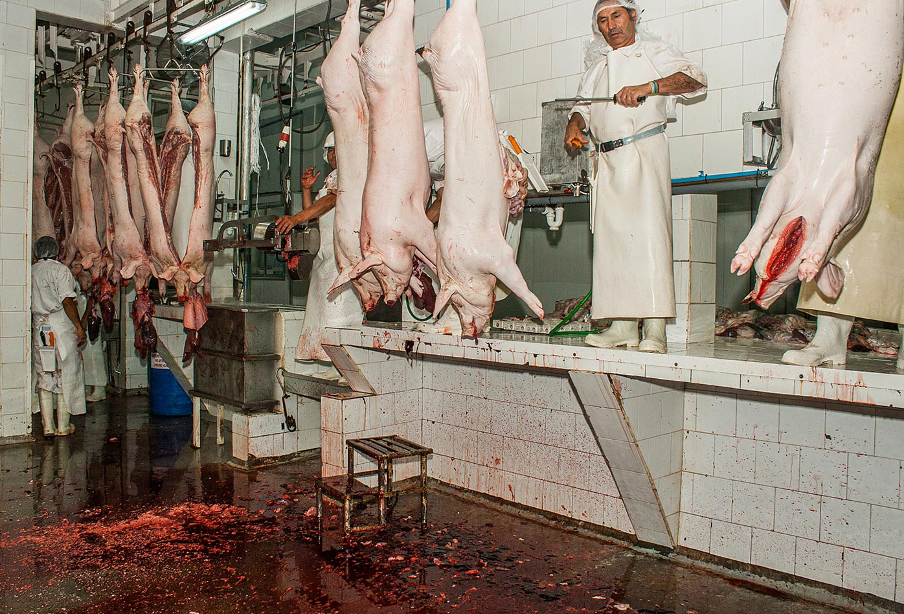
[Trabajadores de pie sobre los mostradores para procesar cerdos muertos en un matadero en Chile, mientras la sangre cubre el suelo・Gabriela Penela / We Animals Media](https://stock.weanimalsmedia.org/search/?searchQuery=WAM18533&assetType=default){:target='_blank' class="caption"}

### Explotación laboral y consecuencias psicológicas de trabajar en mataderos

Es poco probable que quienes se ganan la vida con labores tan desagradables pertenezcan a las juntas directivas de las grandes compañías productoras de carne, o tengan una participación accionaria. Estos trabajos son tomados por personas de bajos recursos que son explotadas para mantener las ganancias de la industria, además de la demanda creciente por productos hechos con cadáveres. Su oficio les hace vulnerables a sufrir lesiones laborales como pérdida de dedos o extremidades, enfermedades respiratorias, infecciones bacterianas y estrés post-traumático.

A quienes trabajan en mataderos se les contrata para matar animales como cerdos y vacas que son en gran parte criaturas amigables. Para realizar esta acción, las y los trabajadores deben desconectarse del acto, y del animal que tienen al frente; esta distancia emocional puede causar fenómenos como violencia doméstica, aislamiento social, ansiedad, abuso de drogas y alcohol, y genera el tipo de estrés mencionado.

Adicionalmente, de un estudio realizado en 2009 por la criminóloga Amy Fitzgerald, se puede concluir que el empleo en los mataderos aumenta las tasas totales de arrestos, los arrestos por delitos violentos, violación y otros delitos sexuales.

### Referencias

* [Intelligent, Emotional Pigs・Farm Sanctuary](https://www.farmsanctuary.org/pigs/){:target='_blank' class="reference"}
* [THINKING PIGS: Cognition, Emotion, and Personality・Lori Marino and Christina M. Colvin・Kimmela Center for Animal Advocacy・The Someone Project](https://www.farmsanctuary.org/pigs/){:target='_blank' class="reference"}
* [Manual de Porcinos・Sitio Argentino de Producción Animal, Dirección de Educación Agraria, Dirección Provincial de educación técnico profesional. Provincia de Buenos Aires.](https://www.produccion-animal.com.ar/produccion_porcina/00-produccion_porcina_general/160-MANUAL_DE_PORCINOS.pdf){:target='_blank' class="reference"}
* [Manual de producción porcícola・Servicio Nacional de Aprendizaje (SENA)](https://repositorio.sena.edu.co/bitstream/handle/11404/4270/porcinos_2005.pdf?sequence=1&isAllowed=y){:target='_blank' class="reference"}
* [Gestión integral en la producción porcina・Servicio Nacional de Aprendizaje (SENA)](https://repositorio.sena.edu.co/sitios/gestion_produccion_porcina){:target='_blank' class="reference"}
* [A Slaughterhouse Nightmare: Psychological Harm Suffered by Slaughterhouse Employees and the Possibility of Redress through Legal Reform・Jennifer Dillard](https://www.researchgate.net/publication/228141419_A_Slaughterhouse_Nightmare_Psychological_Harm_Suffered_by_Slaughterhouse_Employees_and_the_Possibility_of_Redress_through_Legal_Reform){:target='_blank' class="reference"}
* [Slaughterhouses and Increased Crime Rates: An Empirical Analysis of the Spillover From "The Jungle" Into the Surrounding Community・Amy J. Fitzgerald, Linda Kalof, Thomas Dietz](https://www.researchgate.net/publication/249701326_Slaughterhouses_and_Increased_Crime_Rates_An_Empirical_Analysis_of_the_Spillover_From_The_Jungle_Into_the_Surrounding_Community){:target='_blank' class="reference"}
