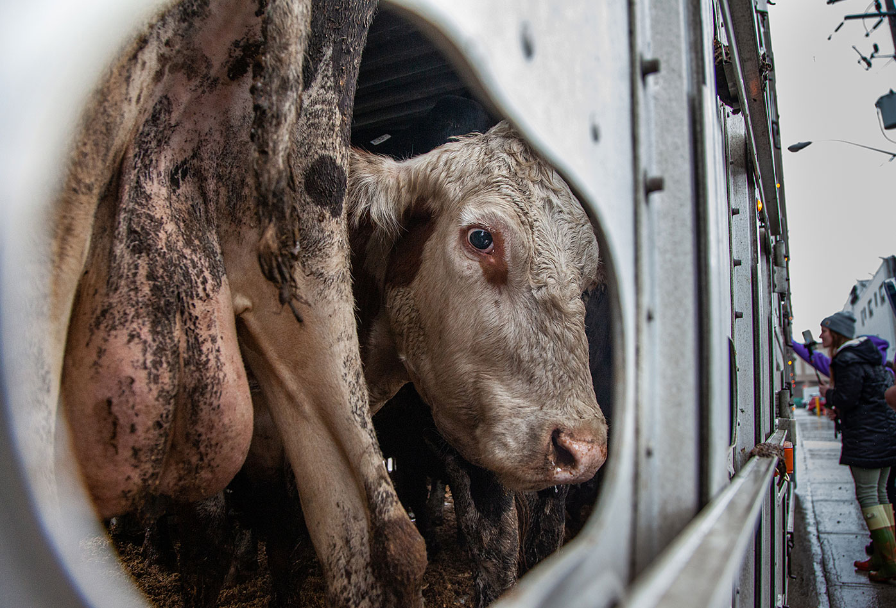
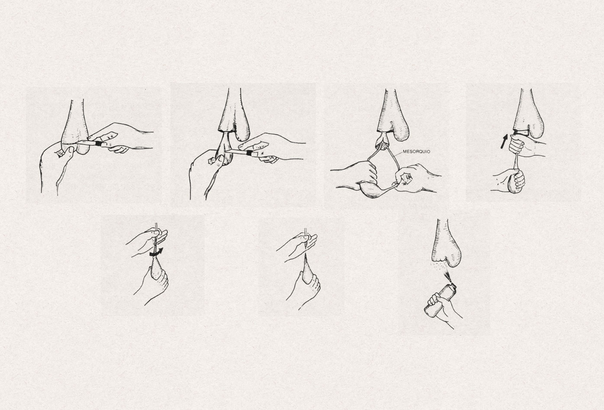
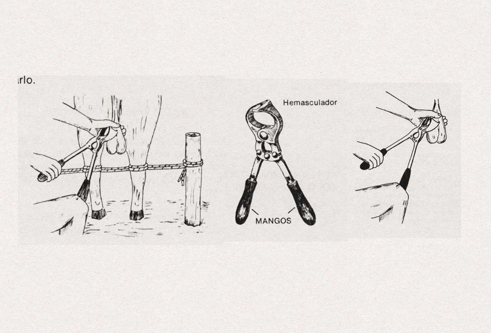
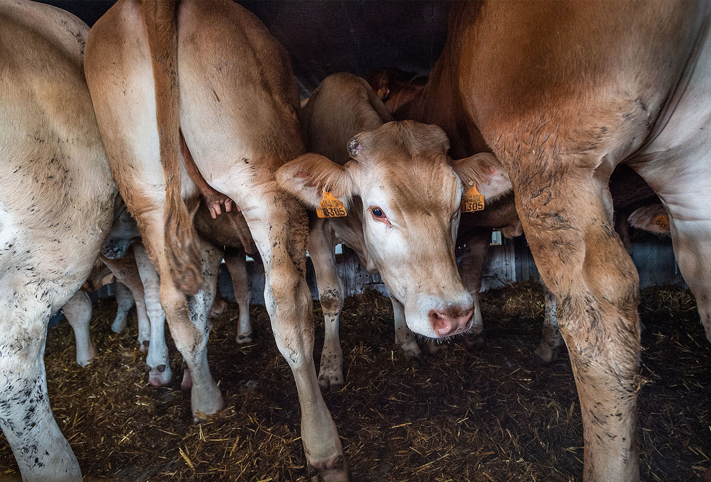
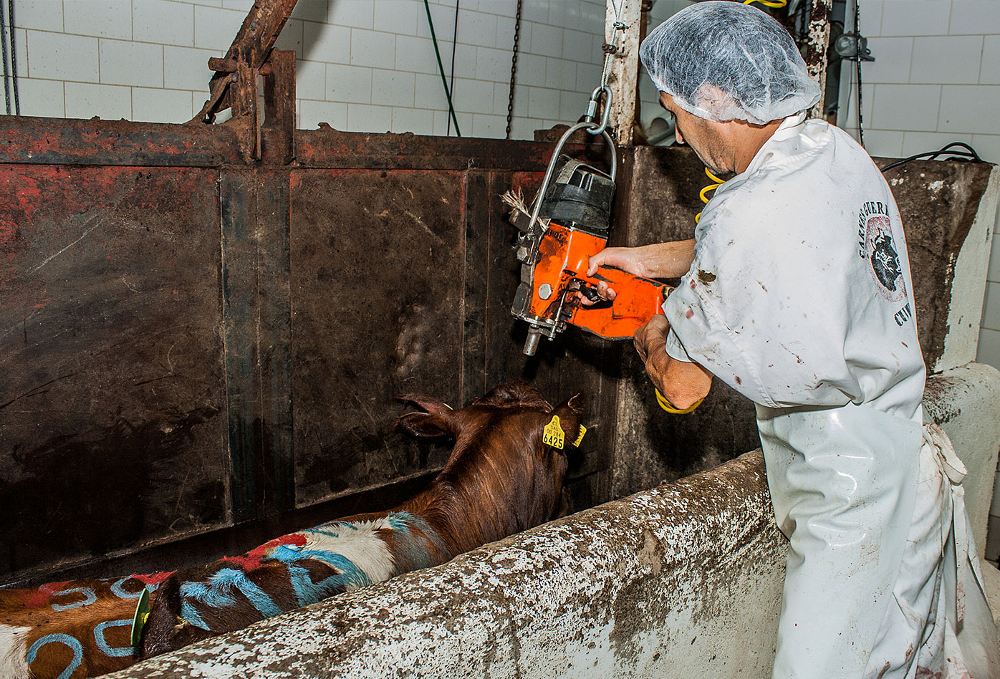
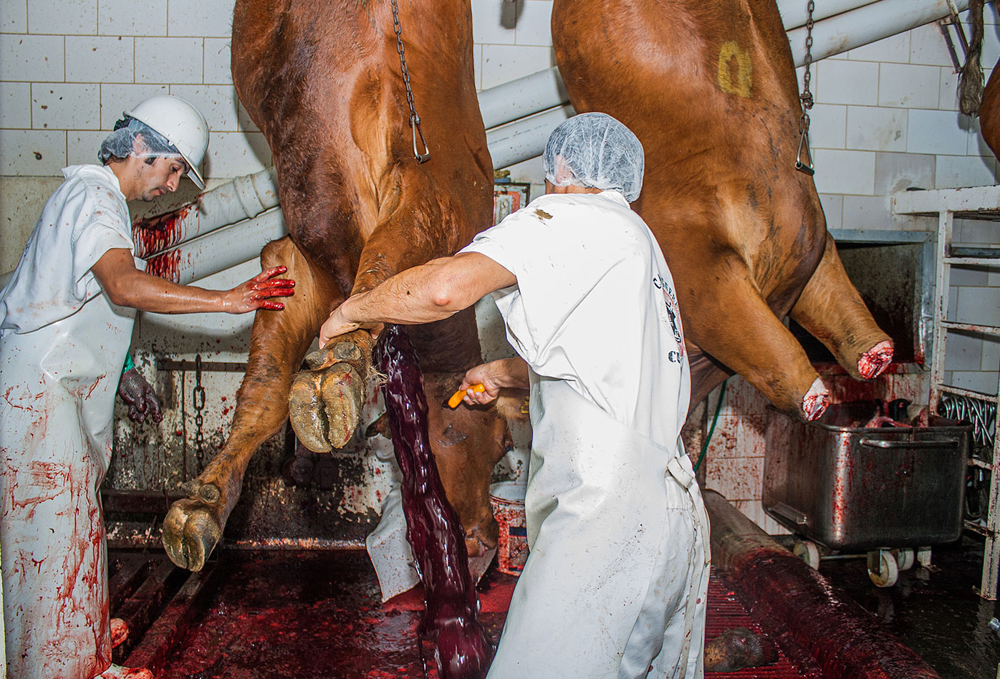

 Contiene imágenes sangrientas y de abuso sexual.

En la lección sobre [la industria láctea](/leccion-la-industria-láctea){:class="link no-underline" target="_blank"} cubrí las características de las especies *Bos Taurus* y *Bos Indicus,* además de la mayoría de procedimientos estándar relacionados a la explotación de animales de estas especies. Aunque encontré con cierta facilidad material acerca de cómo criar vacas para extraer leche de sus cuerpos, hasta ahora no encuentro sobre cómo criar vacas y toros para carne exclusivamente. Al igual que en los manuales para la explotación de gallinas y pollos, en los manuales para la explotación de vacas y toros se mencionan razas mejor adaptadas para diferentes propósitos, unas para producir leche, otras para producir carne, o las que llaman de doble propósito. Estas razas han sido desarrolladas a partir de crianza selectiva que produce animales cuyas características resultan más rentables para la industria, no son la consecuencia de su adaptación al entorno.

[Vacas lecheras llegan a un matadero en el área de Toronto, en un camión de sucio・Louise Jorgensen・Animal Sentience Project・We Animals Media](https://stock.weanimalsmedia.org/search/?searchQuery=WAM25131&assetType=default){:target='_blank' class="caption"}

Contrario a lo que podrían pensar quienes defienden el vegetarianismo entendido como dejar de consumir cadáveres, pero seguir consumiendo secreciones y otros productos; no hay una división real entre la industria láctea y la industria de la carne al menos desde la zootecnia. No sería rentable seguir alimentando a vacas que no producen, y adicionalmente como vimos en la lección sobre [la industria láctea,](/leccion-la-industria-láctea){:class="link no-underline" target="_blank"} es imposible colonizar el cuerpo de una vaca para convertirle en un medio de producción sin ejecutar maltratos y abusos a ella y sus crías. Ejercer propiedad sobre el cuerpo de alguien y administrar ese cuerpo para que produzca beneficios económicos, es una idea cuestionable éticamente, por lo que quienes quieren dejar de participar directamente en la industria financiando a través del consumo, hacen bien si intentan practicar el veganismo, o por lo menos entender la ideología que sostiene la práctica. Es preferible entender y promover la liberación animal así no se tenga éxito en la práctica del veganismo por la razón que sea, a asimliar y promover el vegetarianismo porque resulta más accesible. No me interesa revisar y controlar los hábitos de vida de nadie, pero tampoco puedo promover ideas que no están sustentadas en la realidad objetiva.

En esta lección cubriré las prácticas que no mencioné en la lección sobre [la industria láctea:](/leccion-la-industria-láctea){:class="link no-underline" target="_blank"} extracción de semen, castración, transporte y asesinato (sacrificio). Hay patrones e ideas similares a las que se aplican a la producción de carne de cerdo.

### Extracción de semen

La inseminación artificial ofrece varias ventajas para la industria, previene la diseminación de enfermedades de transmisión sexual, permite que se pueda embarazar a más vacas con semen de animales seleccionados y reduce costos de mantenimiento de toros. Parte del proceso es la extracción del semen, que se realiza mediante diferentes metodologías que son practicas de bestialismo y abuso sexual normalizadas en nuestra cultura.

#### Vagina artificial

La vagina artificial es un tubo de plástico rígido recubierto en su interior por una capa de goma, formando una cámara que se llena de agua caliente. Para el procedimiento se usa como señuelo una vaca, un toro, o un maniquí. Se permite al toro montar al señuelo pero se desvía el pene del toro. En el segundo intento del toro se acomoda la punta del pene desviado en la entrada de la vagina artificial para que el toro la penetre y eyacule.

Esta técnica está muy extendida debido a que bien realizada consigue eyaculados muy limpios, con baja contaminación, y con un equipo de bajo costo, además se pueden observar los reflejos, excitación y líbido del toro.

<iframe src="https://www.youtube.com/embed/XDZRboWy3y4" frameborder="0" allow="accelerometer; autoplay; clipboard-write; encrypted-media; gyroscope; picture-in-picture" allowfullscreen></iframe>

[Extracción de semen de toro・Euskadi Directo](hhttps://www.youtube.com/watch?v=XDZRboWy3y4){:target='_blank' class="caption"}

#### Electroeyaculación

Un electroeyaculador es algo similar a un vibrador que se inserta por el recto del toro para dar pulsos eléctricos leves en la próstata y vesículas seminales, provocando en el toro una erección y una eyaculación.

Como preparación, se recortan los pelos del orificio prepucial, y se limpia. También se limpia el recto y se estimulan mediante masaje transrectal las glándulas accesorias, luego se lubrica el electrodo y se introduce en el recto dirigido ligeramente hacia bajo y realizando movimientos rotatorios. Inicialmente los estímulos son de baja intensidad, para incrementarse deacuerdo a la reacción del toro. Tras la eyaculación, el semen se recolecta con un aparato que envuelve el pene.

<iframe src="https://www.youtube.com/embed/TGtbcFCsg2Y" frameborder="0" allow="accelerometer; autoplay; clipboard-write; encrypted-media; gyroscope; picture-in-picture" allowfullscreen></iframe>

[Colecta de semen utilizando la Electroeyaculación・La Finca de hoy](https://www.youtube.com/watch?v=TGtbcFCsg2Y){:target='_blank' class="caption"}

#### Masaje transrectal

Una persona realiza el masaje y otra que recolecta el semen. Para el masaje se mantiene al toro en una manga, se remueven las heces del recto y se aplica un masaje longitudinal repetitivo hacia adelante y atrás sobre la terminación de los canales deferentes de las vesículas seminales y la región de la próstata, introduciendo la mano y el antebrazo en el recto del toro hasta que el semen fluya hacia la uretra pélvica. El semen se recolecta con una probeta de vidrio.

### Castración

Es recomendable castrar a los bovinos cuando las condiciones de manejo no permiten tener a los toros en potreros separados hasta la venta.

Si el objetivo de la castración es facilitar el manejo del toro, se castra antes de los seis meses de edad, cuando entra a la pubertad; si el objetivo es usar al animal para trabajo, la castración se realiza después de los treinta meses, porque al conservar sus testículos el toro puede desarrollar mejor su musculatura. Los toros castrados son mansos y manejables.

En la cartilla que consulté no hay mención de ningún tipo de anestesia para los procedimientos.

[Castración a testículo descubierto・Castración de bovinos・Servicio Nacional de Aprendizaje](https://repositorio.sena.edu.co/bitstream/handle/11404/486/vol6_castracion_bovinos_op.pdf?sequence=12){:target='_blank' class="caption"}

#### Castración a testículo descubierto

Un tipo de castración en la que se sacan los testículos con un bisturí.

Después de inmovilizar al toro, lavar y desinfectar su escroto y áreas cercanas, se corta el escroto a tres o cuatro centímetros de su extremo con un bisturí desinfectado, o se hace un corte lateral de seis a diez centímetros en la zona de cada testículo, luego se hace un corte longitudinal de unos seis a siete centímetros de la túnica de dartos y la túnica vaginal parietal, para descubrir el testículo. Con el testículo descubierto, se observan unas membranas que unen la túnica con el testículo llamadas mesorquio; el mesorquio se perfora con el dedo índice para romperse halando con firmeza y separar el testículo. A continuación se empuja hacia arriba la túnica vaginal y se desgarra el resto del mesorquio hasta la parte donde el cordón espermático se adelgaza, el cordón espermático se toma con una mano y con la otra se hace torsión hasta lograr la compresión de todo el cordón; sosteniendo con firmeza se continúa con la torsión para desprender el testículo sin cortar con navaja, o también se puede hacer un nudo con el cordón espermático y cortar. Para finalizar se introducen las túnicas y se acomodan dentro del escroto, luego se acomodan los cortes del escroto y se aplica antiséptico en la herida. El toro es dejado en observación durante veinte días.

[Castración con pinzas de burdizo・Castración de bovinos・Servicio Nacional de Aprendizaje](https://repositorio.sena.edu.co/bitstream/handle/11404/486/vol6_castracion_bovinos_op.pdf?sequence=12){:target='_blank' class="caption"}

#### Castración con pinzas de burdizo

Esta técnica se utiliza únicamente en animales menores de un año debido a que en adultos se corre el riesgo de producir inflamaciones y afectaciones graves, además se dificulta el corte del cordón espermático sin dañar la piel. Para la preparación, se sujeta e inmoviliza al toro, se lavan y desinfectan los materiales y manos de la persona que ejecutará la operación, así como el escroto del toro. Para localizar el cordón espermático se toma el testículo con ambas manos palpando el cordón con los dedos índice y pulgar, luego se acomodan las pinzas alrededor del cordón espermático para prensarlo con el emasculador que se cierra tomando un mango con la mano libre mientras se sujeta el otro con la rodilla, las pinzas permanecen cerradas durante unos tres minutos, tiempo en el que son retiradas y se realiza la operación en el cordón del otro testículo. El toro pasa a observación durante ocho días y a los treinta días es revisado para comprobar la degradación de los testículos.

#### Castración con elastrador

Este tipo de castración consiste en estrangular los testículos con una banda que se pone en la parte superior de estos usando una pinza llamada elastrador, también se puede usar para acortar el escroto, en una técnica llamada seudocastración, que se usa en hatos de carne, para que los testículos pierdan la función reproductiva sin perder la función hormonal. Es ejecutada en terneros entre después de los tres meses de edad, y antes de los cuatro.

Para desprender los testículos junto con el escroto, la banda se pone en la parte superior de los testículos, se abre y se pasan los testículos por entre la banda. Cuando está por encima de los testículos, se retira el elastrador y la banda queda aprisionando la parte superior de los testículos.

Para acortar el escroto se pone la banda en la parte inferior del escroto y se empujan los testículos hacia arriba para que queden pegados al abdomen y se atrofien.

Los terneros son observados diariamente para detectar anormalidades, inflamación, fiebre y falta de apetito, durante cuarenta y cinco días.

[Ganado transportado por la frontera entre Turquía y Bulgaria・Jo-Anne McArthur・Eyes On Animals・We Animals Media](https://stock.weanimalsmedia.org/search/?searchQuery=WAM7933&assetType=default){:target='_blank' class="caption"}

### Transporte y asesinato (sacrificio)

Si se deshidratan los animales, el proceso de desollado y enviscerado es más complicado, entonces se suministran cantidades adecuadas de agua antes del transporte, se suspende la alimentación doce horas antes del embarque, y el suministro de agua dos o tres horas antes.

Las víctimas son cargadas al camión una mirando hacia el lado contrario de la otra (cabeza cola), se bajan con la ayuda de un tábano eléctrico para evitar usar palos, piedras, hierros y otros objetos que lesionan las partes del animal donde se encuentran las carnes de mayor calidad. También se usa el tábano para conducir a los animales por pasillos.

#### Inspección ante-mortem

Una revisión para detectar la presencia de enfermedades y separar animales sanos de quienes tienen enfermedades. No se asesinan al tiempo, se aislan en corrales diferentes hasta que se hayan asesinado y descuartizado a quienes estaban bien de salud.

#### Reposo, limpieza y conducción

Las víctimas se mantienen mínimo doce y normalmente veinticuatro horas en su corral. Durante ese periodo únicamente se proporciona agua. Al terminar la etapa de reposo los animales se conducen a una manga donde se limpian con chorros de agua fría. El lavado remueve suciedades de la piel, posibilita que la sangre se concentre en grandes vasos sanguíneos mejorando la sangría, lo que favorece la conservación de la carne y mejora su color; también retira parásitos externos y facilita el avance de los animales por las rampas de conducción. Después de la limpieza externa las víctimas son llevadas hasta la caja de insensibilización con ayuda del tábano eléctrico.

[Una vaca cubierta en marcas de pintura es inmobilizada en el sistema de restricción del cuerpo mientras un trabajador se prepara para aturdirla con un perno cautivo en la cabeza・Gabriela Penela・We Animals Media](https://stock.weanimalsmedia.org/search/?searchQuery=WAM17406&assetType=default){:target='_blank' class="caption"}

#### Aturdimiento (Insensibilización)

Conducen a la víctima a la caja de insensibilización donde se le dispara con una pistola de perno cautivo en el punto de la intersección entre las líneas imaginarias entre cada ojo y el cuerno opuesto, o se puede usar una técnica llamada apuntillado que consiste en clavar una puntilla en la parte anterior de la nuca, a nivel de la unión de la cabeza con el cuello.

Por último se abre la puerta lateral giratoria del cajón para que la vaca o el toro desplace hasta el área de caída.

#### Izado

Un grillete es instalado en la pata izquierda de la víctima cuando está en el suelo, y se eleva hasta enganchar el grillete en el riel de sangría.

[Un trabajador de matadero perfora la garganta de una vaca suspendida mientras otro trabajador ayuda a mantenerla en su sitio・Gabriela Penela・We Animals Media](https://stock.weanimalsmedia.org/search/?searchQuery=WAM17408&assetType=default){:target='_blank' class="caption"}

#### Sangría

Degollamiento o corte para desangrar.

Sangría alta: un corte por detrás de la mandíbula inferior, seleccionando los grandes vasos sanguíneos a nivel del cuello.

Sangría baja: un corte realizado en el lado izquierdo de la unión del cuello y el pecho. Este corte genera un mayor sangrado pero deteriora la piel y disminuye su valor comercial.

La sangre se recoge en recipientes metálicos limpios y se destina al consumo humano, la producción de harina de sangre o se usa como abono.

[Un trabajador de matadero posa entre dos vacas muertas que están listas para ser desolladas・Gabriela Penela・We Animals Media](https://stock.weanimalsmedia.org/search/?searchQuery=WAM17388&assetType=default){:target='_blank' class="caption"}

#### Descuartizamiento (Faenado)

Después de la sangría se procede a desollar, descuartizar y eviscerar el cadáver, remover las partes utilizables del enviscerado, y dejar el cadáver como canal de dónde se obtienen los cortes de carne. Es un proceso con muchos pasos que no creo necesario cubrir acá.

...

La industria recurre a eufemismos con los que busca normalizar la violencia que comete contra los animales. Palabras como "sacrificio" y "faenado" suenan inofensivas, cuando las acciones que describen son asesinato y descuartizamiento. La palabra "insensibilización" para referirse a un golpe o perforación con la que se aturde a animales para que sean más fáciles de manejar, deja la impresión de que los animales no siente cuando se le mata como si se les matara en un estado de anestesia. Un asesinato humanitario y limpio que aunque fuese cierto, por innecesario seguiría siendo éticamente inválido.

### Referencias

* [Métodos de Extracción de Semen Bovino・Ronnie de Jesús Arieta Román, José Antonio Fernández Figueroa, Jackeline Menchaca Peña・Universidad Veracruzana](https://www.produccion-animal.com.ar/informacion_tecnica/inseminacion_artificial/225-extraccion_semen.pdf){:target='_blank' class="reference"}

* [Inseminación Artificial: Importancia, Historia, Ventajas y Desventajas / Generalidades de la Ganadería Bovina](http://generalidadesdelaganaderiabovina.blogspot.com/2015/03/inseminacion-artificial-importancia.html){:target='_blank' class="reference"}

* [Extracción de semen del toro・Euskadi Directo](https://www.youtube.com/watch?v=XDZRboWy3y4){:target='_blank' class="reference"}

* [Colecta de semen utilizando la Electroeyaculación・La Finca de Hoy](https://www.youtube.com/watch?v=TGtbcFCsg2Y){:target='_blank' class="reference"}

* [Castración de bovinos・Servicio Nacional de Aprendizaje](https://repositorio.sena.edu.co/bitstream/handle/11404/486/vol6_castracion_bovinos_op.pdf?sequence=12){:target='_blank' class="reference"}

* [Transporte de ganado bovino・José Ignacio Sánchez Gómez / Sitio Argentino de Producción Animal](https://www.produccion-animal.com.ar/informacion_tecnica/comercializacion/34-transporte.pdf){:target='_blank' class="reference"}

* [Transporte, sacrificio y faenado de ganado・Servicio Nacional de Aprendizaje](https://repositorio.sena.edu.co/bitstream/handle/11404/3848/transporte_sacrificio_faenado_ganado.pdf){:target='_blank' class="reference"}
