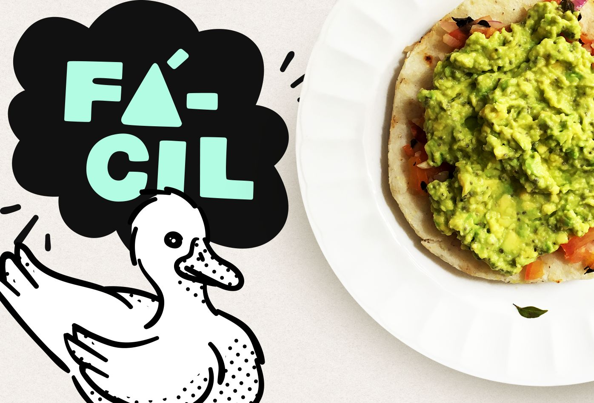

<figure>
  
</figure>

<h3>Ingredientes</h3>

<ul>
  <li>- Arepa</li>
  <li>- Medio aguacate mediano</li>
  <li>- Cebolla</li>
  <li>- Medio tomate</li>
  <li>- Semillas de chía</li>
  <li>- Sal</li>
</ul>

<h3>Preparación</h3>

Asa la arepa en una parrilla a fuego bajo por unos 5 minutos por cada lado.

Corta el aguacate en cuadritos, agrégalo a un tazón, agrega sal, semillas de chía, parte y revuelve los cuadritos con un tenedor hasta que quede como una crema.

Pica cebolla y tomate en pedazos pequeños, pon a calentar una sartén un rato en fuego bajo y agrega un cuarto de cucharada pequeña de aceite (yo uso de ajonjolí) o una cucharada de agua, agrega la cebolla y espera uno o dos minutos, agrega el tomate y revuelve por unos dos minutos.

Esparce el hogao sobre la arepa, agrega el guacamole y listo. Puedes acompañar con un tazón pequeño de papaya en cuadritos con limón y la bebida de tu preferencia.

