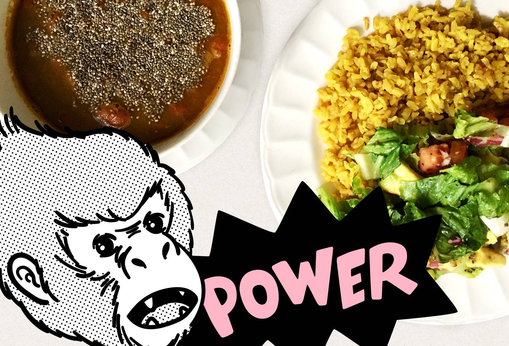

<figure>
  
</figure>

<h3>Ingredientes</h3>

<ul>
  <li>Media libra de fríjoles</li>
  <li>Una auyama pequeña</li>
  <li>Paprika (Opcional)</li>
  <li>Cúrcuma (Opcional)</li>
  <li>Media cucharadita de moringa (Opcional)</li>
  <li>Arroz integral</li>
  <li>Semillas de chía</li>
  <li>Semillas de quinua</li>
</ul>

<h4>Ensalada sugerida</h4>

<ul>
  <li>Lechuga</li>
  <li>Tomate</li>
  <li>Cebolla roja</li>
  <li>Calabacín</li>
  <li>Aguacate</li>
  <li>Vinagre balsámico</li>
</ul>

<h3>Preparaciones previas</h3>

Remojar los fríjoles durante mínimo ocho horas.

<h3>Preparación</h3>

Remover el agua de los fríjoles y agregarlos a una olla express. Añadir agua, auyama pelada y picada, cucharada y media de páprika, cucharada y media de cúrcuma, media cucharadita de moringa, cuatro cucharadas de semillas de quinua y sal al gusto.

Cocinar los frijoles durante 45 minutos, remover la ayuama, licuar y agregarla de nuevo.

Servir en un tazón y agregar semillas de chía. Se puede acompañar con una ensalada, unos cuadritos de plátano maduro y una bebida.

