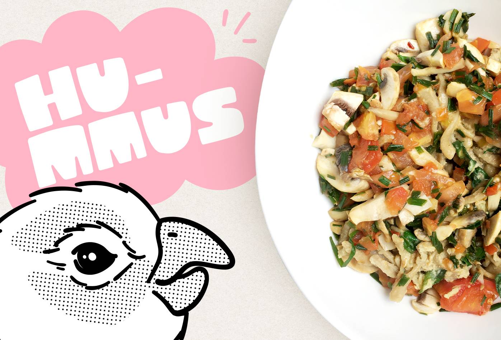

<figure>
  
</figure>

<h3>Ingredientes</h3>

<ul>
  <li>Pasta integral (Si la consigues)</li>
  <li>Media libra de garbanzos</li>
  <li>200 gramos de ajonjolí</li>
  <li>Un limón</li>
  <li>Dos dientes de ajo</li>
  <li>Tomate cherry o tomate normal picado en cuadritos</li>
  <li>Cebollín</li>
  <li>Espinaca</li>
  <li>Champiñones</li>
  <li>Pimienta roja (Opcional)</li>
</ul>

<h3>Preparaciones previas</h3>

Remojar los garbanzos durante mínimo ocho horas.

<h3>Preparación</h3>

<h4>Garbanzos</h4>

Remover el agua de los garbanzos y agregarlos a una olla express. Agregar sal al gusto, cocinar los garbanzos durante 30 minutos.

Secar los garbanzos y guardar el agua en la que se cocinaron.

<h4>Tahine</h4>

Tostar el ajonjolí durante cinco minutos y dejar enfriar, pasar a un procesador de alimentos o licuadora, agregar un poquito de sal y licuar. Agregar lentamente agua de garbanzos hasta obtener una pasta cremosa y guardar en un recipiente.

<h4>Hummus</h4>

Abrir los dientes de ajo, remover la vena interior, presionar con el la parte plana del cuchillo y picar finamente, si tienes macerador macerar.

Agregar al procesador o licuadora los garbanzos, el tahine, los ajos y el jugo de un limón, licuar los garbanzos agregando lentamente agua de garbanzos hasta que se forme un puré. En licuadora generalmente es necesario parar, revolver con una cuchara grande y volver a licuar.  Nunca meter la cuchara con la licuadora prendida.

<h4>Espinaca</h4>

Cortar la espinaca en tiritas. Hervir agua en una olla y agregar la espinaca a una vaporera o un colador de metal para que no toque el agua. Tapar y dejar al vapor durante cinco minutos.

<h4>Cebollín, tomate y champiñones</h4>

Picar finamente el cebollín, picar el tomate y los champiñones en cuadritos, agregar pimienta roja y saltear en una sartén caliente durante unos tres minutos.

<h4>Pasta</h4>

Hervir agua, agregar sal y la pasta. Cocinar revolviendo esporádicamente durante 10 a 15 minutos o según las instrucciones de la pasta que escojas y remover el agua.

<h4>Pasta con hummus</h4>

Revolver el hummus y la espinaca con la pasta, servir y agregar el cebollín, tomate y champiñones salteados. Acompañar con una bebida y una fruta dulce.

