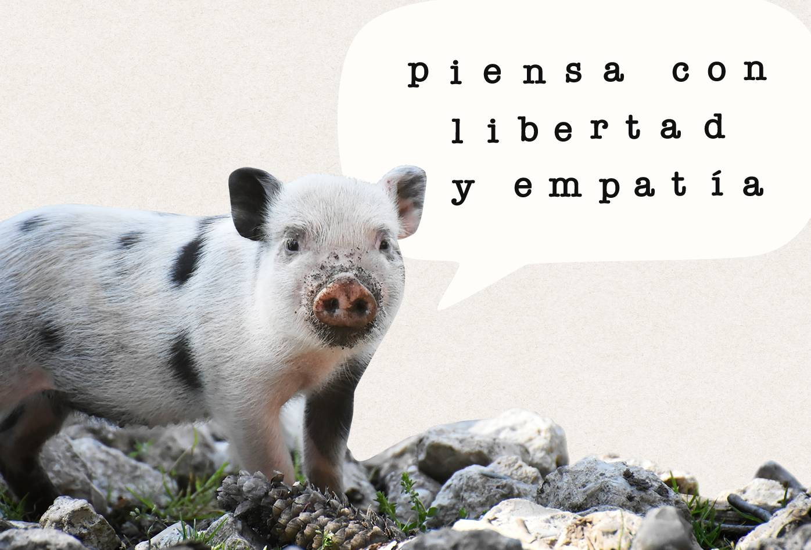

El carnismo es una ideología dominante e invisible, eso quiere decir que la mayoría piensa y actúa según esta ideología sin saber que lo hace y que la mayoría fuimos adoctrinados según sus principios. Quienes nos educaron no tenían y probablemente a la fecha todavía no tienen idea de que son parte de un sistema de adoctrinamiento.

La mayoría de la población es especista y disfruta serlo igual que nosotrxs antes de cuestionarnos sobre la relación de nuestra especie con otras. La mayoría de nuestrxs amigxs, familiares, compañerxs de trabajo y personas que admiramos probablemente participan activamente y de buena gana de la esclavitud, tortura y asesinato sistemático de billones de animales con capacidad para experimentar sus propias vidas subjetivamente, emociones y sensaciones. Para la mayoría de humanos tener en cuenta los intereses de quienes consideran inferiores y creados para un propósito es una ridiculez y su ideología les provee de un arsenal casi ilimitado de mitos para justificar la violencia contra los animales y protegerse ante la posibilidad de aceptar argumentos que se sostienen lógicamente y están basados en información observable y comprobable.

¿Son gente perversa que disfruta de la crueldad? probablemente no, o al menos no conscientemente. Al igual que nosotrxs crecieron en una cultura en donde la empatía se limita y reprime cada vez más y dentro de un sistema educativo al que si por suerte tenemos acceso, en la mayoría de los casos nos queda debiendo las herramientas para desarrollar nuestro pensamiento crítico.

La violencia que necesariamente se ejerce hacia los animales que decidimos convertir en máquinas de producción y/o productos es espeluznante y es algo que es normal no querer ver, por eso la industria tiene éxito en el esfuerzo de ocultarla y distorsionar la percepción sobre sus propias actividades. A la población en general le queda muy fácil ignorar y justificar esta violencia porque sus cuellos no son los que están siendo rajados sino los de individuos de otras especies y las manos que ejercen la violencia son las de trabajadorxs mal remuneradxs sin mayores opciones cuyo bienestar y salud mental tampoco son importantes en nuestra cultura.

Sentir rabia, indignación y tristeza es normal. Al escribir esto recordé un montón de imágenes de violencia contra los animales que decidí ver para entender de lo que estoy hablando y vino a mi mente con lágrimas en mis ojos otro recuerdo todavía más difícil. Las miradas de angustia y desesperación de animales de pocos meses de edad, hambrientxs, sedientxs y heridxs, sucixs y oliendo horrible que conectaron con nosotrxs a través de las rejas de camiones en donde fueron hacinadxs para transportar hacia el matadero. Visitando las entradas de los mataderos que es hasta donde podemos llegar sin violar las leyes que protegen a estas empresas dedicadas a la violencia institucionalizada, se pueden escuchar los perturbadores gritos de dolor que emiten lxs cerdxs mientras son asesinadxs.

Tristeza, rabia, indignación, decepción, culpa, odio, alienación y toda clase de emociones difíciles son el precio que pagamos por ejercer nuestro derecho a pensar, activar nuestra empatía y cuestionar el sistema. Sin embargo no podemos dejarnos dominar por estas emociones. Es necesario mantener la cordura, tratar de entender las razones que llevan a personas que por lo general no son malvadas a ser parte de la barbarie por acción, omisión, ignorancia o impotencia, entender que la violencia contra los animales responde a una ideología de la que la mayoría no es consciente y que despertar esa conciencia es un proceso complejo que pasa por generar espacios de reflexión libres de acusaciones, insultos, humillación intelectual y acciones que pongan a la defensiva a quienes pueden ser nuestrxs aliadxs en la lucha contra los verdaderos opresores. Un número preocupante de veganxs nos hemos dejado llevar por la ira y la misantropía para terminar hiriendo la dignidad de otras personas. Algunxs hemos podido reflexionar y reconocer nuestro error para hacer un esfuerzo encaminado a transformar el resentimiento en disciplina para estudiar, rigurosidad para argumentar, empatía y pensamiento estratégico, mientras que otrxs han decidido eliminar la empatía hacia su propia especie. En una cultura violenta que venera el poder y premia la agresividad no es una sorpresa que personajes que promueven la venganza e indiferencia ante el sufrimiento humano alcancen niveles de influencia considerables y tengan a su disposición plataformas con acceso a millones de seguidores desde donde promueven el activismo por los derechos de los animales como un activismo en contra de, o incompatible con los derechos humanos. Es muy probable que el primer contacto con el activismo hecho por veganxs sea contenido de activistas y creadores de contenido como Gary Yourofsky, Vegan Gains, Freele, e instituciones como Anonymous for the Voiceless. En mi caso fue así y no tuve la capacidad para no dejarme influenciar por sus discursos.

En Colombia tenemos a Fernando Vallejo y a Carolina Sanín quienes al parecer disfrutan de humillar, insultar y apabullar a no veganxs, sin tener en cuenta que podrían usar su influencia generando espacios en donde más personas puedan acceder a las ideas que sustentan el veganismo desde una argumentación rigurosa y disciplinada que invite a reflexionar.

{:class="p-space-img"}

Que este tipo de veganxs y sus discursos tengan tanta visibilidad y popularidad prueba que podemos liberarnos de una ideología de opresión y violencia mientras seguimos bajo la influencia de otras. El veganismo interseccional y la educación dirigida a entender diferentes sistemas de dominación, explotación y discriminación de las que somos víctimas y victimarixs en mayor o menor medida son fundamentales si queremos detener la ola ecofacista y autodestructiva dentro del veganismo.

Con preocupación debo decir que estamos en un momento de la historia en el que la mayoría de la población pasa una buena parte de su tiempo consumiendo información personalizada al detalle con el objetivo de extraer reacciones de cada “usuaria o usuario” generada y/o seleccionada por algoritmos programados para maximizar el “engagement” dentro de plataformas de marketing disfrazadas de redes sociales. Nuestra población que ya venía con un déficit en educación de calidad y ya era víctima de los intereses oscuros de propietarios de medios de comunicación corporativos e instituciones dedicadas a imponer el pensamiento mágico, ahora además es adicta a sus celulares y a consumir y crear información diseñada para generar reacciones emocionales y pasar rápidamente sin ningún análisis. No veo mucha disposición para la honestidad intelectual y el pensamiento crítico necesarios para cuestionar ideologías que justifican nuestros propios privilegios. Es clave entender esta dificultad y buscar como atravezar burbujas mediáticas.

La situación podría empeorar si triunfan iniciativas encaminadas a reemplazar la educación pública, integral y que no descarta lo presencial por una exclusivamente técnica, completamente virtual y privada. Defender la educación pública es fundamental.

Internet y el conjunto de tecnologías desarrolladas para aprovechar la red tienen la posibilidad de liberar la información y el conocimiento. Deberíamos estar experimentando la vida en una sociedad libre y racional, a la altura de los problemas que heredamos pero que tendríamos que estar trabajando para solucionar. Al contrario vivimos en una sociedad dividida y confundida por un sistema al que le conviene que no podamos pensar ni tener empatía.

Sobrevivir en una cultura especista implica disciplina, autocontrol, capacidad para escuchar y analizar, cuidado de la salud mental y solidaridad. Entender las ideas detrás del especismo y otros ejercicios de opresión, desarrollar habilidad para generar espacios de reflexión que permitan una comunicación respetuosa, saber cuando hablar, cuando escuchar, entender conceptos en lugar de memorizar discursos y puntos, no pretender introducir el veganismo a la fuerza en cualquier conversación, autocrítica, entendimiento de nuestras limitaciones, paciencia para dejar pensar y entender que una deprogramación ideológica es un proceso complejo que necesita unos tiempos. Debemos estar abiertos a escuchar y entender que nosotrxs también podríamos estar programados ya no por el carnismo sino por alguna otra ideología que no vemos. 

Es muy útil también encontrar o crear comunidades donde podamos compartir y cuidarnos entre todxs sin aislarnos ni alienar a los demás, especialmente a quienes a pesar de no ser veganxs hacen parte de otros movimientos de resistencia que es importante entender y apoyar porque se enfrentan a ideologías opresoras que también nos afectan.
