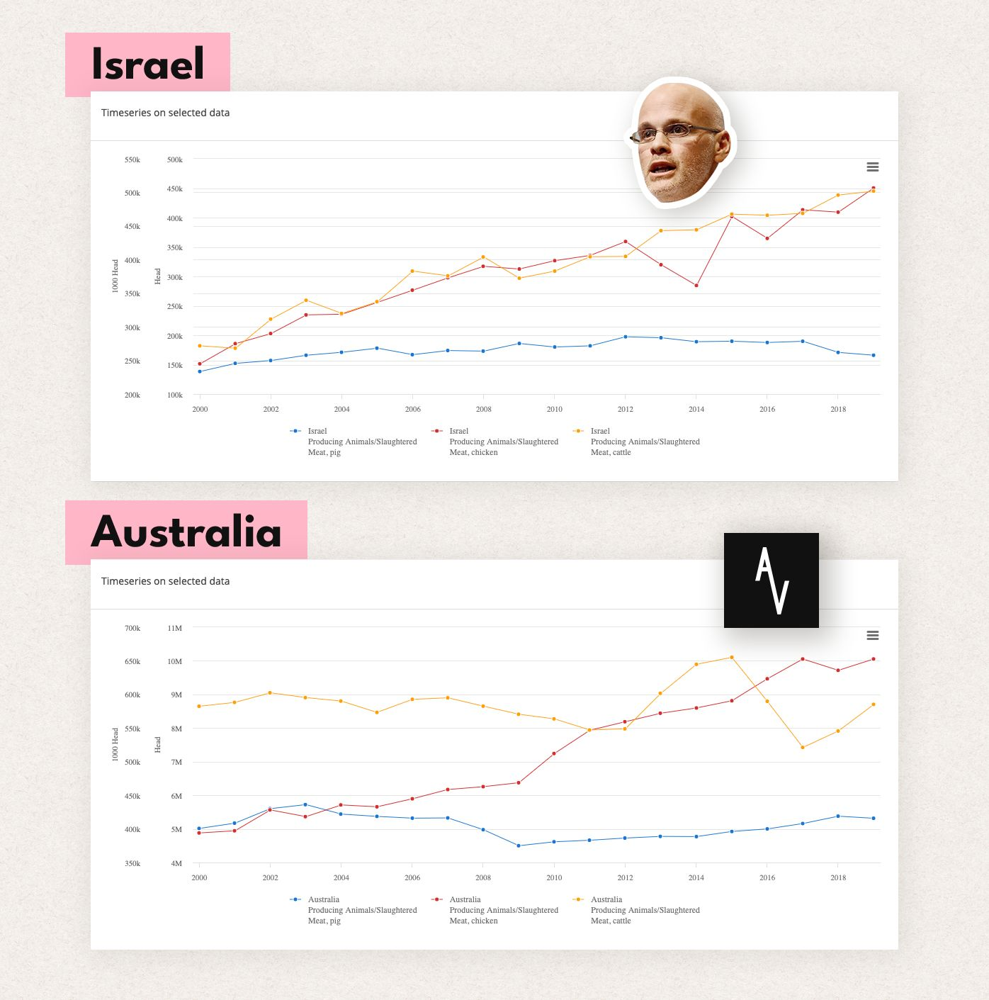
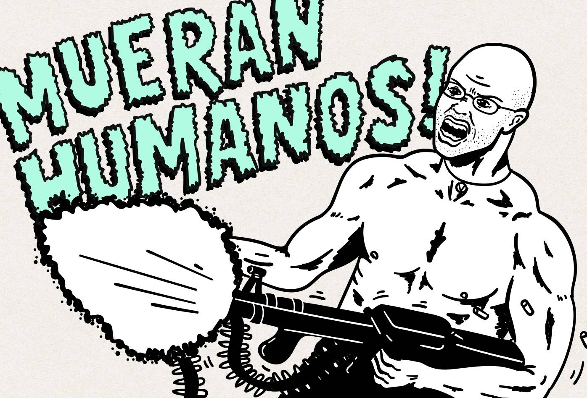

Dice la leyenda que cuando “El mejor discurso que jamás escucharás” fue traducido al hebreo y promovido por activistas en Israel, la población vegana de ese país alcanzó el 8%. Si esa historia es cierta tendríamos que replantear la relación entre consumo individual y producción, que quienes promueven el veganismo como un problema de oferta y demanda defienden, porque la producción ganadera de Israel continuó creciendo como si nada luego de que este señor apareció en la escena en el 2013, y ha crecido de manera estable en Australia después de la aparición de Anonymous for the Voiceless en 2016. Sin comprobar si este video fue crucial o no en un incremento de la población vegana, si el incremento es real o si fue relevante, la noticia se propagó y le alcanzó a les seguidores de esta celebridad, para posicionarlo como un líder dentro del movimiento.

[FAOSTAT・Food and Agriculture Organization of the United Nations](http://www.fao.org/faostat/en/#compare){:target='_blank' class="caption"}

[La caída en la producción de ganado bovino en Australia entre el 2015 y el 2017 se debe a un corte del 80% de las exportaciones de Australia a Indonesia・Quit the Vegan Movement, Part 02 // S03 E04 // Are We Winning・The Cranky Vegan・Youtube](https://www.youtube.com/watch?v=LZrsrkF13Dw&list=PLDi86oKRn2xuu8vr0WiN_jENdDD56BAPo&index=4){:target='_blank' class="caption"}

La imagen de Gary Yourofsky como un pionero del activismo que ha dedicado su vida por los animales y un ejemplo a seguir, es promovida por cuanto grupo de activismo anti-interseccional existe, que al hacerlo trabaja consciente o inconscientemente para aumentar la influencia mediática de este auto declarado misántropo que no pierde oportunidad para promover el odio contra nuestra especie y sus fantasías violentas. Miles de veganes alrededor del mundo interiorizan su ideología de odio y elaboran argumentos para justificar las desafortunadas declaraciones de esta celebridad infame del veganismo.

Haré un repaso por las fantasías violentas que este influenciador poderoso dentro de nuestra burbuja mediática, ha expresado durante su desastrosa carrera. Los textos contienen descripciones gráficas de asesinato, tortura, abuso sexual, racismo y misantropía violenta. Advierto que el contenido es ofensivo y desagradable.

### Gary Yourofsky y sus fantasias de abuso sexual, tortura y asesinato

_“En el fondo, honestamente espero que la opresión, tortura y asesinato vuelvan a cada humano indiferente multiplicadas por diez. Espero que los hijos accidentalmente le disparen a sus padres en excursiones de caza, mientras los carnívoros sufren ataques cardíacos que los maten lentamente._ _Toda mujer envuelta en piel debería soportar una violación tan cruel que le deje cicatrices para siempre. Mientras cada hombre atrincherado en piel debería sufrir una violación anal tan horrorosa que lo convierta en destripado._ _Todo vaquero de rodeo y matador debería ser corneado hasta la muerte, mientras abusadores de circos son aplastados por elefantes y mutilados por tigres. Por último, la ironía debería asomar su cabeza esotérica en forma de investigadores que experimentan con animales contrayendo enfermedades debilitantes y extinguiéndose dolorosamente porque los dólares destinados a la investigación, que se pudieron usar para tratarlos, se desperdiciaron en la barbárica y anti científica práctica de la vivisección.”_

[Rape Accusations, Violence, Erika and George Carlin! Wait. What?・Gary Yourofsky・Youtube](https://youtu.be/4ykzTPvy4_Y?t=553){:target='_blank' class="caption"}

En sociedades con altos índices de violencia sexual, la posibilidad de que alguien vistiendo piel sufra de abuso sexual es lo suficientemente alta como para que la fantasía violenta de Yourofsky se haya cumplido varias veces. Para defenderse de acusaciones por promover la violencia sexual y demostrar que está en contra de la violación declaró:

_“Esto es lo que pienso que le debería pasar a los violadores. Hasta a alguien que viola a una mujer en un abrigo de piel (si es que eso alguna vez pasa):_

_Creo que su pene y bolas deberían ser arrancadas lentamente con un removedor de cutícula y luego creo que dos brochetas deberían introducirse entre las cuencas de sus ojos, arrastrarlo a otra habitación. Luego deberían remojar sus bolas y pene en diarrea y vómito. Deberían darle la opción de comer eso a cambio de salvar sus vidas. Y si lo comen, Yo tomaría una pistola, la pondría entre sus ojos y diría: solo estaba bromeando.”_

[Rape Accusations, Violence, Erika and George Carlin! Wait. What?・Gary Yourofsky・Youtube](https://youtu.be/4ykzTPvy4_Y?t=17){:target='_blank' class="caption"}

Este señor todavía está convencido de que con este comentario reparó su reputación, lo que demuestra su ideología violenta y su total desconexión con los derechos humanos.

{:class="p-space-img"}

### Gary Yourofsky proponiendo el asesinato como estrategia para la liberación animal

_“Pasará en un futuro muy cercano que alguien entrará en un matadero o un laboratorio de vivisección con pistolas y le dirá a los trabajadores del matadero: “Quita tus cuchillos de las gargantas de estos cerdos ahora mismo o te voy a disparar. Somos los defensores. Tal vez te gustaría llamarlo violencia, pero ¡oye! te lo estás buscando. ¿Y toda esa mierda de que la violencia genera violencia? Cuando las fuerzas aliadas entraron a la Alemania Nazi y mataron Nazis para proteger Judíos, yo me pregunto: ¿Cuál fue la violencia que pasó después de eso?”_

[Does Violence Have a Place in Animal Liberation?・Bite Size Vegan・Youtube](https://youtu.be/4En39iyK4DA?t=177){:target='_blank' class="caption"}

El comentario demuestra un desconocimiento de la historia que raya lo infantil. Durante la post-guerra nunca se trataron las causas que provocaron el conflicto, y después de la guerra brotaron innumerables enfrentamientos armados alrededor del mundo de los que aún sufrimos consecuencias. Es ingenuo decir que el imperialismo y la supremacía racial están erradicados cuando todas las grandes potencias los practican.

_“Ustedes no se oponen a la violencia, solo se oponen a para quién yo propongo que sean violentos. Podemos matar a favor de judíos, podemos matar a favor de niños, pero nadie quiere matar a favor de gallinas, vacas y cerdos. Creo que estos animales estarían vehementemente en desacuerdo y yo también.”_

[Does Violence Have a Place in Animal Liberation?・Bite Size Vegan・Youtube](https://youtu.be/4En39iyK4DA?t=330){:target='_blank' class="caption"}

### Gary Yourofsky legitimando la tortura y el asesinato

_“No me pidas que tenga empatía por los victimarios, mi corazón está suficientemente dolido por las víctimas, no voy a llorar por un victimario que está siendo torturado y asesinado. Que se jodan.”_

[Does Violence Have a Place in Animal Liberation?・Bite Size Vegan・Youtube](https://youtu.be/4En39iyK4DA?t=415){:target='_blank' class="caption"}

### El racismo disfrazado de misantropía de Gary Yourofsky

_“La última mentira que se ha esparcido sobre mi es que soy un racista, porque en una calmada y sobria evaluación de la situación entre Israel y Palestina, dije que_ _los palestinos son el grupo de gente más psicótica del planeta”_

[Palestinians, Blacks and Other Hypocrites・Gary Yourofsky・Youtube](https://youtu.be/pqhUIns86cA?t=636){:target='_blank' class="caption"}

Uno de sus estudiantes afroamericanos le dijo que los animales no humanos vivían como reyes y reinas. Este señor respondió que lastimosamente viven como _“Burguer Kings”_ y _“Dairy Queens”_ e inmediatamente después le preguntó _“¿Qué desayunaste esta mañana? ¿Cadáver de vaca, cadáver de negro o cadáver de judío?”_ y _“¿De qué están hechos tus zapatos? ¿de piel de vaca, de piel de negro o de piel de judío?_

[Palestinians, Blacks and Other Hypocrites・Gary Yourofsky・Youtube](https://youtu.be/pqhUIns86cA?t=729){:target='_blank' class="caption"}

_“La gente negra ha venido marchando en las calles de Estados Unidos porque un puñado de policías psicóticos los han venido asesinando con casi total impunidad. Al final del día estos activistas se van a su casa a comer animales asesinados”_

Hay veganes y activistas antiespecistas dentro de la población afroamericana que son constantemente ignorades por activistas veganes anti-interseccionales, quienes se atreven a hablar de “los negros” como si fueran todes lo mismo. La legitimidad del movimiento anti-racista se sigue sosteniendo, aún suponiendo que en las acciones contra la brutalidad policial y el racismo institucional no hay negres veganes. Gary Yourofsky remueve de consideración moral a quienes trabajan por la reivindicación de sus derechos, porque su supuesta hipocresía descalifica una causa justa. Su postura no es muy diferente a la de cualquier suprematista blanco.

También hay grupos de activismo por los derechos de los animales en Palestina como la [Palestinian Animal League.](https://pal.ps/en/){:target='_blank' class="link"} Negar la existencia de movimientos por los derechos de los animales no humanos en Palestina, es instrumentalizar el veganismo para justificar el _apartheid_ al que el estado de Israel tiene sometida a esta población, y deslegitimar una causa justa. Tampoco tiene mucho sentido porque básicamente en todas las culturas y en todos los países se utilizan a los animales como recursos. Si analizamos las cifras, los países "desarrollados" son responsables por más muertes de animales tanto por ganadería y pesca como por impacto ambiental de su población, que los países "subdesarrollados".

### La misantropía de Gary Yourofsky

_“Soy un misántropo, no un racista, odio a todos los seres humanos. Palestinos e israelitas, todos los humanos son una plaga psicótica para este planeta. Blancos, negros, hombres, mujeres, heterosexuales, homosexuales, demócratas… Mierda, hasta odio a los veganos”_

[Palestinians, Blacks and Other Hypocrites・Gary Yourofsky・Youtube](https://youtu.be/pqhUIns86cA?t=23){:target='_blank' class="caption"}

Este héroe del veganismo no tiene en cuenta que los movimientos sociales están compuestos por animales humanos, y que el diminuto movimiento antiespecista no va a atraer a más activistas, ni conseguir aliados gritando que odiamos a la humanidad. La misantropía es literalmente odio descontrolado que puede tener consecuencias peligrosas y no debería ser normalizado.

### La hostilidad contra activistas de derechos humanos de Gary Yourofsky

_“No soy un hipócrita como los activistas por derechos humanos que están en constante violación de los principios de equidad cada segundo de cada día”_

[Palestinians, Blacks and Other HypocritesvGary Yourofsky・Youtube](https://youtu.be/pqhUIns86cA?t=575){:target='_blank' class="caption"}

Les defensores de derechos humanos arriesgan sus vidas por el bienestar de sus comunidades, y al igual que en los movimientos anti-racistas, dentro de cualquier movimiento por los derechos humanos vamos a encontrar a veganes trabajando y arriesgando sus vidas. Este tipo de mensajes pone en grave riesgo la seguridad de activistas veganes o no, al vilificarles y disimuladamente justificar cuando algún terrorista decida acabar con sus vidas. Tanto en en Medio Oriente como en Colombia, activistas por los derechos humanos son asesinados a diario.

Hay más pero no quiero seguir escuchando a este personaje tan espantoso. Si revisan los videos pueden notar el tono rabioso y lenguaje corporal amenazante de esta celebridad del veganismo que nos habla como si estuviese a punto de pegarnos un puño.

O los movimientos de activismo anti-interseccional apoyan este tipo de ideas, o no han hecho el trabajo de revisar el contenido que crean las celebridades que recomiendan. Cualquiera que sea la razón, impulsar a este personaje dentro de sus medios es inaceptable. Al intentar denunciar la ideología violenta de Gary Yourofsky ante uno de estos grupos que lo recomiendan, la respuesta fue que elles no pueden revisar cada declaración de cada creador o creadora de contenido, y que lo que promueven es “El mejor discurso que jamás escucharás”, no al autor. La respuesta no tiene en cuenta que están enviando a sus estudiantes a un video en Youtube al que seguramente le pondrán like y se suscribirán al canal, para seguir viendo y compartiendo el odio de este desquiciado que fue recomendado por mentores en quienes depositan su confianza. Les activistas entusiastas de las redes sociales, al parecer no saben como funcionan.

Al antiespecismo no le faltan figuras con un mínimo de calidad humana y madurez que nos representen adecuadamente, tampoco contenido más interesante que el discurso de un energúmeno. A cambio de un video prescindible, estos movimientos anti-interseccionales están promoviendo a un matón ridículo como nuestro representante. Dudo mucho que esta situación le convenga al antiespecismo y a los animales.

Soy un adulto responsable de mis propias decisiones, pero al introducirme en esta burbuja mediática del veganismo anti-interseccional, en el que este tipo de contenido es aceptable y admirable, eventualmente normalicé e interioricé algo de la ideología de odio que promueven estos líderes, para luego sufrir las consecuencias psicológicas y sociales que aparecen cuando se siente odio por más del 90% de la población. De alguna manera pude despertar y cambiar mi posición, pero no quedo muy tranquilo pensando en que estos movimientos de activismo antiespecista anti-interseccional siguen induciendo a sus estudiantes más curioses por un camino autodestructivo de aislamiento y odio.