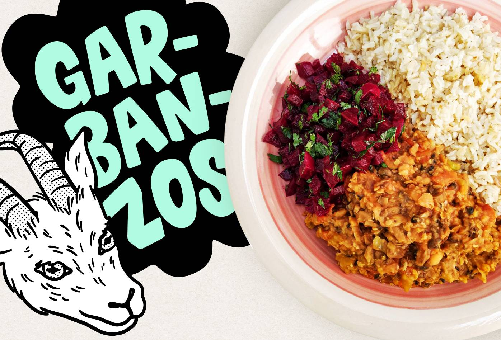

<figure>

</figure>

Anímate preparar algo rico, económico y saludable como éste picado súper sencillo con ensalada de remolacha que te hace recordar la comida de las abuelas.

<h3>Ingredientes (2 a 3 porciones)</h3>

<ul>
  <li>280 gr de champiñones</li>
  <li>170 gr de garbanzos</li>
  <li>4 dientes de ajo</li>
  <li>3 cm de jengibre</li>
  <li>2 tallos de apio</li>
  <li>2 tomates chonto</li>
  <li>Pasta de tomate</li>
  <li>1 cda de salsa soya </li>
  <li>1 cdita de vinagre balsámico o de manzana</li>
</ul>

<h3>Ensalada sugerida</h3>

<ul>
  <li>1 remolacha grande</li>
  <li>Cilantro</li>
  <li>Aceite de oliva</li>
  <li>Jugo de limón</li>
</ul>

<h3>Preparación</h3>

<ol>
  <li>Cocinar los garbanzos y la remolacha por aparte.</li>
  <li>En una olla grande caramelizar la cebolla con peperoncino.</li>
  <li>En una olla bien caliente agregar aceite de oliva y poner los champiñones cortados en cuadritos (no revolver tanto para que doren bonito).</li>
  <li>Luego añadir el ajo y jengibre picados, el apio y el tomate chonto en trozos pequeños. Revolver por un par de minutos.</li>
  <li>Adicionar la salsa soya, el vinagre, la pasta de tomate, un poco de agua y salpimentar.</li>
  <li>Cortar la remolacha como más te guste, ponerle cilantro, limón, aceite de oliva y revolver.</li>
</ol>

Sirve con arroz integral y disfruta de las cosas sencillas y deliciosas que te da la vida.

Para más recetas visítame en instagram <a class="link" target="_blank" href="https://www.instagram.com/saluda_lu">@saluda_lu</a>

