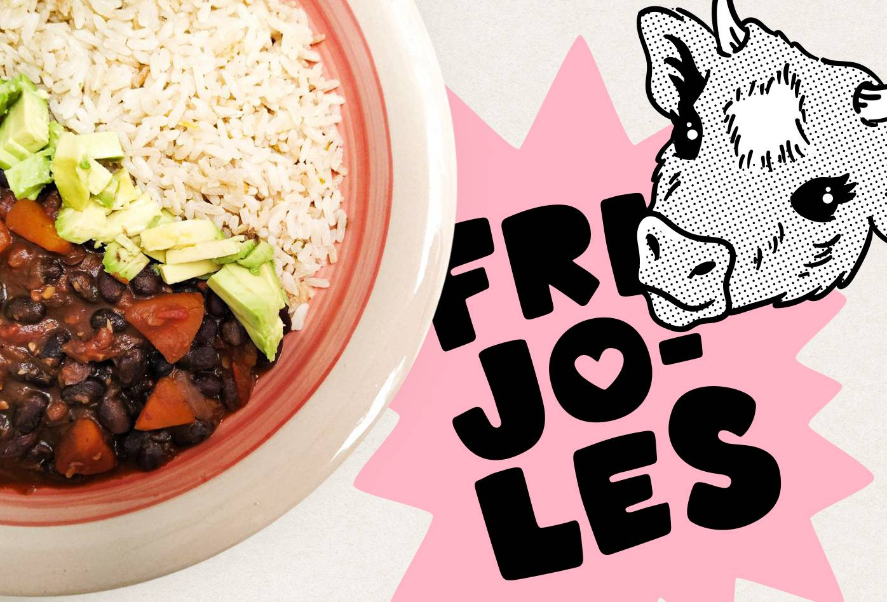

<figure>

</figure>

Nutritivo, fácil y rico. Una receta que te salvará en esos días agitados y que podrás guardar sin problema para llevar al trabajo. Además podrás darle un toque diferente y más aromático utilizando las hojas del apio 😉.

<h3>Ingredientes (4 porciones)</h3>

<ul>
  <li>200 gr de fríjoles caraota</li>
  <li>1 calabaza mediana</li>
  <li>1 cebolla morada</li>
  <li>1/4 de peperoncino (opcional)</li>
  <li>1/2 cdita de paprika</li>
  <li>1/4 cdita de ajo molido (opcional)</li>
  <li>4 dientes de ajo</li>
  <li>3 cm de jengibre</li>
  <li>4 ramitas de tomillo seco</li>
  <li>2 tomates</li>
  <li>1 cdita de sal marina o sal normal</li>
  <li>1 cda de pasta de tomate</li>
  <li>1 taza de caldo de verduras o agua</li>
</ul>

<h3>Preparación</h3>

<ol>
  <li>Cocinar en olla presión los fríjoles con mitad de la calabaza sin piel cortada en cuadrados (ayuda a espesar la salsa y al sabor).</li>
  <li>En una olla grande caramelizar la cebolla con peperoncino. Agregar las especias, el resto de la calabaza en cuadraditos. Luego el jengibre, ajo, tomates picados, tomillo y salpimentar. Revolver hasta que el tomate se haga salsa.</li>
  <li>Finalizar con la pasta de tomate, caldo de verduras y los frijoles. Calentar hasta que estén los cuadritos de calabaza.</li>
</ol>

Recomiendo servir con arroz integral, un poco de aguacate y disfrutar cada bocado 😊.

Para más recetas visítame en instagram <a class="link" target="_blank" href="https://www.instagram.com/saluda_lu">@saluda_lu</a>

